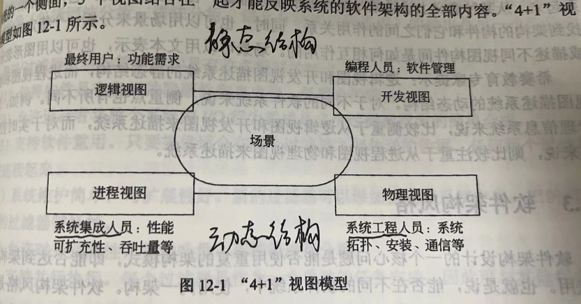
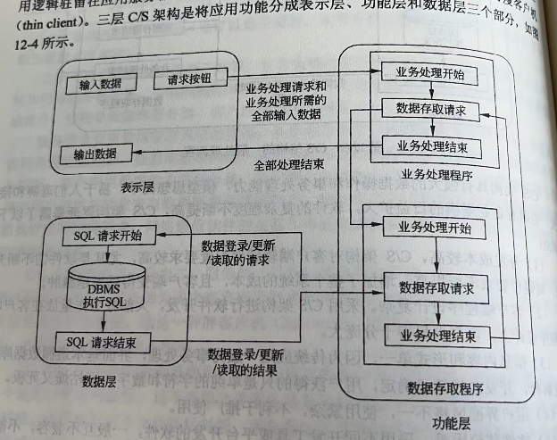
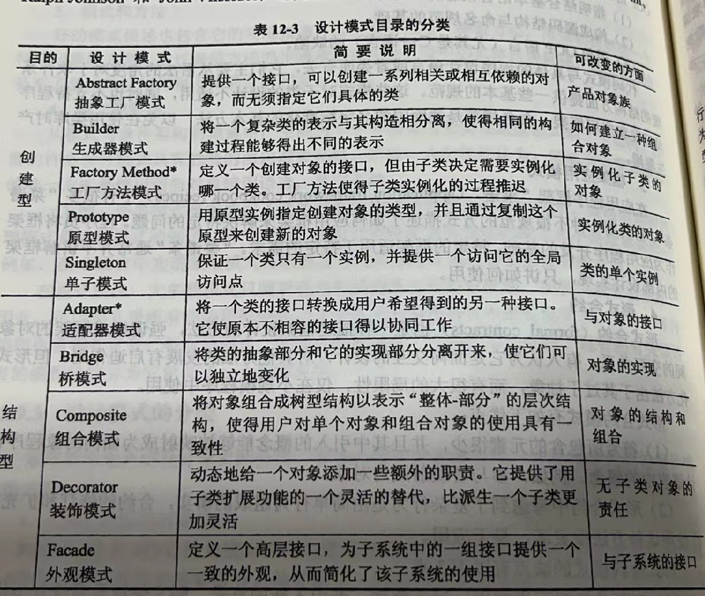
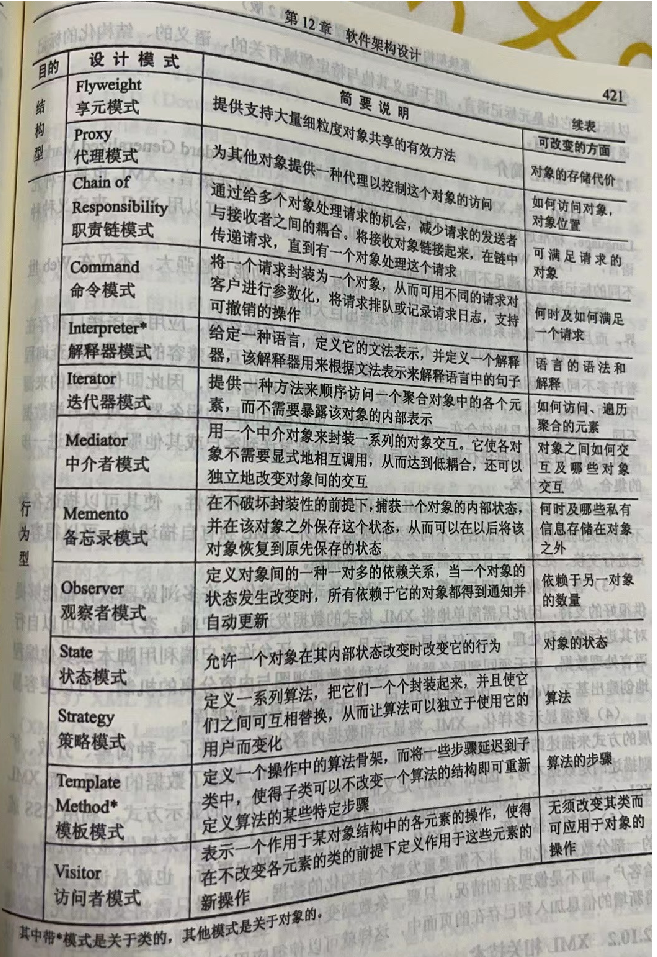

# 软件架构设计

## 1、概述

软件架构的作用：

- 软件架构是项目干系人进行交流的手段；
- 软件架构是早期设计决策的体现；
- 软件架构是可传递和可重用的模型；

## 2、建模

软件架构的模型分为5种：

- **结构模型；**（常用）
- 框架模型；
- **动态模型；**（常用）
- 过程模型；
- 功能模型；

将5种模型有机地统一在一起，形成一个完整的模型来刻画软件架构更格式。

“4 + 1”视图模型从5个不同的视角来描述软件架构：

- 逻辑视图；主要支持系统的功能需求。

- 开发视图；也称为模块视图，主要侧重于软件模块的组织和管理。

- 进程视图；侧重于系统的运行特性，主要关注一些非功能性的需求，例如系统的性能和可用性。

- 物理视图；主要考虑如何把软件映射到硬件上，它通常要考虑到解决系统拓扑结构、系统安装、通信等问题。

- 场景；可以看作是那些重要系统活动的抽象，它使四个视图有机联系起来。

## 3、架构风格

### 3.1 管道/过滤器

在管道/过滤器风格的软件体系结构中，每个构建都有一组输入和输出，构件读输入的数据流，经过内部处理，然后产生输出数据流。

### 3.2 数据抽象和面向对象

这种风格建立在数据抽象和面向对象的基础上，数据的表示方法和它们的相应操作封装在一个抽象数据类型或对象中。

### 3.3 基于事件的隐式调用

基于事件的隐式调用风格 的思想是 构件不直接调用一个过程，而是触发或广播一个或多个事件。

系统中的其他构件中的过程 在一个或多个事件中注册，当一个事件被触发，系统自动调用在这个事件中注册的所有过程，这样，一个事件的触发就导致了另一个模块中的过程的调用。

基于事件的隐式调用风格的主要特点是事件的触发者并不知道哪些构件会被这些事件影响。

### 4.4 分层系统

层次系统组成一个层次结构，每一层为上层服务，并作为下层客户。

### 3.5 仓库系统及知识库

在仓库风格中，有两种不同的构件：中央数据结构说明当前状态，独立构件在中央数据存储上执行。若构件控制共享数据，则仓库是一个传统型数据库。若中央数据结构的当前状态触发进程执行的选择，则仓库是一个黑板系统。

黑板系统主要由三部分组成：

- 知识源。知识源中包括独立的、与应用程序相关的知识，知识源之间不直接进行通信，它们之间的交互只通过黑板来完成；
- 黑板数据结构。黑板数据是按照与应用程序相关的层次来组织的解决问题的数据，知识源通过不断的改变黑板数据来解决问题；
- 控制。控制完全由黑板的状态驱动，黑板状态的改变决定使用的特定知识。

### 3.6 C2风格

C2体系结构风格可以概括为通过连接件绑定在一起，按照一组规则运行的并行构件网络；

**系统组织规则如下：**

系统中的构件和连接件都有一个顶部和一个底部；

构件的顶部应连接到某个连接件的底部，构件的底部则应连接到某连接件的顶部，而构件和构件之间的直接连接是不允许的；

一个连接件可以和任意数目的其他构件和连接件连接；

当两个连接件进行直接连接时，必须有其中一个的底部连接到另一个的顶部。

### 3.7 客户机/服务器风格

C/S体系结构有三个主要组成部分：数据库服务器、客户应用程序、网络；

### 3.8 三层 C/S 结构风格

二层 C/S 结构是单一服务器且以局域网为中心的，所以难以扩展至大型企业广域网，软硬件组合及集成能力有限，客户机的负荷太重，难以管理大量的客户机，系统的性能容易变坏，数据安全性不好。

三层 C/S 体系结构是将应用功能分为表示层、功能层、数据层：

- 表示层。表示层是应用的用户接口部分，它担负着用户与应用间的对话功能。
- 功能层。功能层相当于应用的本体，它是将具体的业务处理逻辑编入程序中。
- 数据层。数据层就是DBMS，负责管理对数据库的读写。

### 3.9 B/S 架构

B/S 架构是上层 C/S 结构的一种实现方式，具体结构为浏览器/Web 服务器/数据库服务器。

## 4、特定领域软件架构（DSSA）

“领域”的含义，有两种理解方式：

- 垂直域：定义了一个特定的系统族，包括整个系统族内的多个系统，结果是在该领域中可作为系统的可行解决方案的一个通用软件架构。
- 水平域：定义了多个系统和多个系统族中功能区域的共有部分，在子系统级上涵盖了多个系统族的特定部分功能，单无法为系统提供完整的通用架构。

### DSSA 的基本活动

- 领域分析。目标是获得领域模型。
- 领域设计。目标是获得领域架构。
- 领域实现。目标是一句领域模型和DSSA开发和组织可重用信息。

### 参与 DSSA 的人员

领域专家、领域分析师、领域设计人员、领域实现人员。

## 5、架构设计与演化

设计和演化过程：

- 实验原型阶段。获得对系统支持的问题域的理解。
- 演化开发阶段。重点为最终产品的开发。

## 6、基于架构的软件开发

6个子过程：

- 架构需求
- 架构设计
- 架构文档化
- 架构复审
- 架构实现
- 架构演化

## 7、软件架构评估

软件架构风险：是指架构设计中潜在的、存在问题的架构决策所带来的隐患。

敏感点：是指为了实现某种特定的质量属性，一个或多个系统组件所具有的特性。

权衡点：是指影响多个质量属性，并对多个质量属性来说都是敏感点的系统属性。

### ATAM评估方法

架构权衡分析方法，9个步骤：

（1）描述

- 描述ATAM方法
- 描述业务冬季
- 描述架构

（2）调查分析

- 确定架构方法
- 生成质量属性效用树
- 分析架构方法

（3）测试

- 讨论和场景分级
- 分析架构方法
- 描述评估结果

### SAAM评估方法

软件架构分析方法，6个步骤：

- 形成场景
- 描述架构
- 对场景进行分类和确定优先级
- 对间接场景的单个评估
- 评估场景的相互作用
- 形成总体评估

## 8、设计模式

创建型、结构型、行为型

工厂设计模式：定义了创建对象的接口，允许子类决定实例化哪个类，而且允许请求者无须知道被实例化的特定类，这样可以在不修改代码的情况下引入新类。

优点：

- 没有了将应用程序类绑定到代码中的要求，可以使用任何实现了接口的类；
- 允许子类提供对象的扩展版本；

应用场景：

- 类不能预料它必须创建的对象的类；
- 类希望其子类指定它要创建的对象；

## 9、面向服务的架构（SOA）

SOA 是一种粗粒度、松耦合的服务架构，其服务之间通过简单、精确定义接口进行通讯，不涉及底层编程接口和通信模型。3 个特征：

- 松散耦合
- 粗粒度服务
- 标准化接口

## 10、企业服务总线（ESB）

是由中间件技术实现并支持SOA的一组基础架构，支持异构环境中的服务、消息以及基于事件的交互，并且具有适当的服务级别和可管理性。

优势：

- 扩展的、基于标准的链接。
- 灵活的、服务导向的应用组合。
- 提供重用率，降低成本。
- 减少市场反应时间，提高生产率。