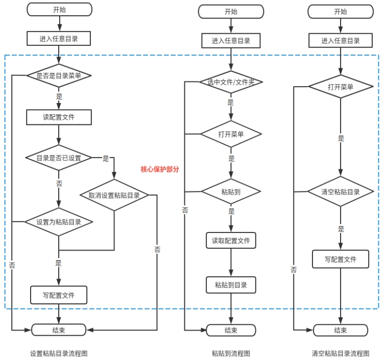
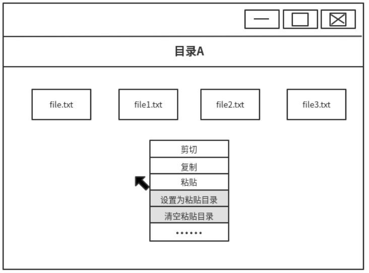
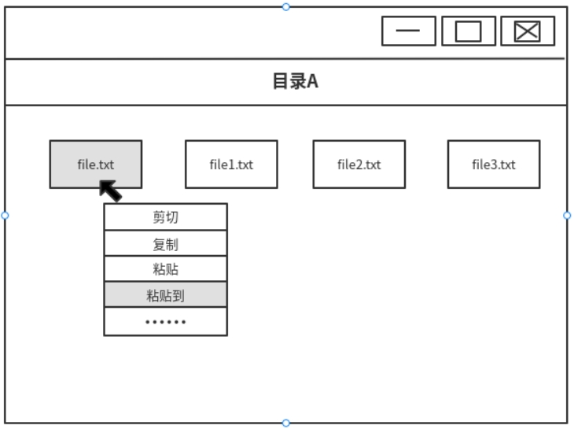
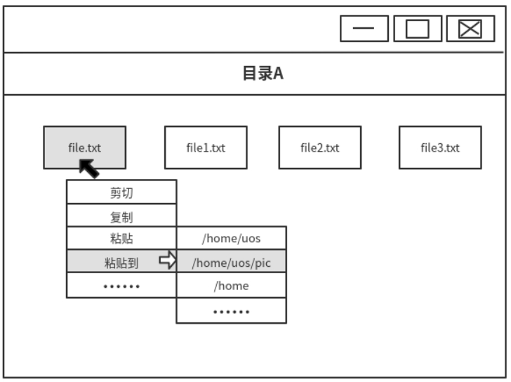

# 一种先确定粘贴目录再复制文件的技术交底书

0、缩略语和关键术语定义

无。

 

1、相关技术背景（背景技术），与本发明最相近似的现有实现方案（现有技术）

在当今各类操作系统中，用户对复制粘贴的功能使用度越来越高，对于文件之间的粘贴复制功能的需求也越来越多。本文主要是针对用户在文件管理器中，实现先确定粘贴目录，再从不同的目录中，选择需要复制的文件粘贴到指定的目录中。

根据现状，现有的操作系统复制粘贴功能都只能先确定需要复制的文件，再确定粘贴的目录，首先进入目录A选中需要复制的文件，再进入目录B进行粘贴，当需要在同一个目录下，将不同的文件粘贴到不同的目录，需要多次重复操作；当在一个目录中，如果有多个文件需要粘贴到指定目录，在复制时漏选一个，此时需要先进入需要复制的目录，再去到粘贴的目录进行粘贴操作，这样显得操作繁琐，因此，实现先确定粘贴目录，再确定复制文件目录成为了当今操作系统一个十分迫切的需求。

1.1、与本发明相关的现有技术

1.1.1、现有技术一的技术方案

目前主流的Windows和UOS操作系统的复制粘贴功能都是先确定复制文件，再确定粘贴路径，无法实现先确定粘贴路径，再确定复制文件，其中Windows有发送到的功能，该功能是将文件通过快捷方式的形式，在两个不同的目录进行访问，实现的方式是通过软连接建立联系。

 

1.1.2、 现有技术一的缺点

目前的主流操作系统的实现方式，只能先确定需要复制的文件，再确定粘贴的目录，如果存在相同目录中，有多个文件需要复制时，就需要进行多次重复的操作，其中Windows的发送到功能是通过软连接的方式去访问文件，属于同一份文件，并没有新增文件出来。

2、本发明技术方案的详细阐述

2.1、本发明所要解决的技术问题

本发明有效解决了文件管理器先确定待粘贴路径，再确定文件复制的相关问题：

1. 用户在同目录中，可以将不同的文件或者文件夹，复制到不同的目录中；如目录A中具有文件1、文件2、文件3，用户可以只在目录A中将文件1复制到目录B，文件2复制到目录C，文件3复制到目录D中，此时可以省去进入分别目录B、目录C进行粘贴的操作；

2. 用户在不同的目录中，可以将文件或者文件夹粘贴到相同的目录中，如目录A中具有文件1、目录B中文件2，用户可以再目录A直接将文件1复制到目录C，再进入目录B将文件2复制到目录C中，此时可以省去两次进入目录C进行粘贴的操作；

3. 用户可以在不同的目录中，把不同的文件或者文件夹粘贴到不同的目录中，如在目录A将文件1复制到目录E，在目录B将文件2复制到目录F，此时省去分别进入目录E、目录F进行粘贴操作

备注：上述被复制的文件或者文件夹可以是一个或者多个

2.2、本发明提供的完整技术方案

在本发明中，核心部分技术方案是根据一个粘贴目录的配置文件来记录所有可粘贴的目录，然后用户可以将任意的文件或者文件夹粘贴到可粘贴的目录中。对于粘贴到功能分为两个部分：第一部分是用户设置可粘贴的目录，粘贴目录的相关信息会记录到配置文件中；第二部分是用户可在任意的目录将任何的文件包括文件夹选择粘贴到可粘贴的目录中，概要步骤如下所示：

1. 用户在任意目录的空白区域右键菜单中，把当前路径设置或者取消设置为可粘贴目录，应用程序会同步修改配置文件

2. 用户在任意的目录中，可将任何的文件或者文件夹选中后，右键菜单中选择粘贴到，然后选择粘贴目录

对应的流程图如下图1 所示，其中蓝色框为核心保护部分：

 

 

图1 流程图

 

2.2.1、可粘贴目录配置文件的管理

当用户对某个路径设置为可粘贴目录时，会将该目录的相关信息写入配置文件中；当用户选择粘贴到时，会读取该配置文件，因此采用**.json**配置文件记录，设计如下表的关键信息字段：

 

|          |                                                              |          |
| :------: | :----------------------------------------------------------: | :------: |
| 字段名字 |                             作用                             | 是否必填 |
| FilePath | 用于记录当前可粘贴的文件路径，当选择粘贴到功能后，将文件复制到该路径下 |    是    |

**.json**配置文件设计格式内容可以如下所示：

|                                                              |
| ------------------------------------------------------------ |
| **\[****{****        "FilePath":"/home/uos/filepath/"****},****{****        "FilePath":"/home/uos/Videos/"****},****{****        "FilePath":"/home/uos/Pictures/"****}****]** |

 

2.2.2、设置为粘贴目录的设置方式

本节主要阐述用户如何将目录设置为粘贴目录的操作，假设用户在目录A中，打开目录菜单，并设置为粘贴目录，如下图2所示：

 

图2 用户设置为粘贴目录的状态图

目录菜单中除了通常的复制粘贴功能外，系统还提供**设置为粘贴目录、取消设置粘贴目录、清空粘贴目录**的功能，用户选择后，提示设置成功，同样也可以使用预先设置的系统快捷键实现此功能。

当该路径已经被设置为粘贴目录时，目录菜单的文案是取消设置为粘贴目录，用户选择该选项后，配置文件同步删除该条目录；当该目录未被设置为粘贴目录时，文案是设置为粘贴目录，用户选择该项后，配置文件同步更新；当用户选择清空粘贴目录时，配置文件同步清空

2.2.3、粘贴到功能的使用

本节主要阐述粘贴到的功能，当用户在其他的任何目录，选中文件或者文件夹后，目录菜单中选择粘贴到选项，工作流程如下图3所示：

 

图3 粘贴到流程图

 

然后再取配置文件，然后出现选择路径选项，选择具体的路径后，即完成粘贴到的功能，展示效果如下图4所示：

 

图4 选择粘贴到选项的效果图

 

2.3、本发明技术方案带来的有益效果

本发明技术方案通过增加一个可粘贴目录的配置文件，程序读取配置文件中的信息实现先确定粘贴目录，再确定复制文件，提升用户的使用体验。本发明技术方案依赖性小，通用性强，运行性能高，可用于任何操作系统先确定粘贴路径，再确定复制路径的解决方案中。

本技术方案还可以在配置文件中增加排序的字段，在选择粘贴到的选项中把经常使用的路径排在前面，方便用户选择，进一步提高系统的实用性。

 

2.4、针对上述技术方案，是否还有替代方案同样能完成发明目的

无

 

3、本发明的技术关键点和欲保护点是什么

本发明的技术关键点是：

（1）先确定粘贴目录再复制文件的设计流程与实现

（2）多目录多文件复制粘贴的架构设计。

4、附件：

参考文献（如专利/论文/标准等）
