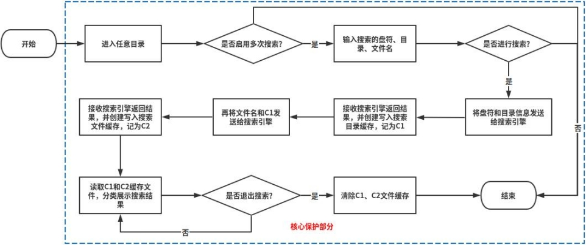
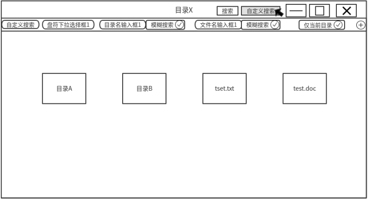
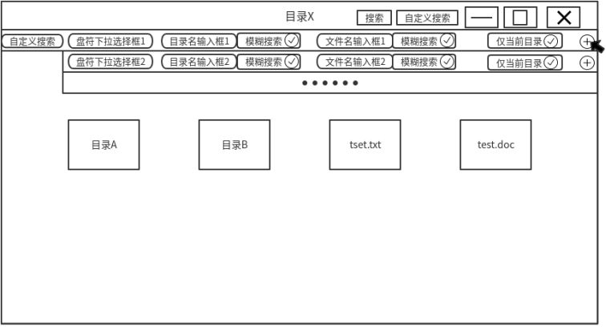
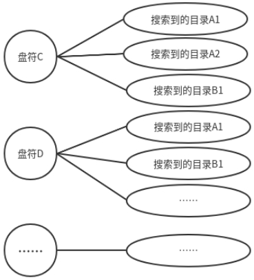
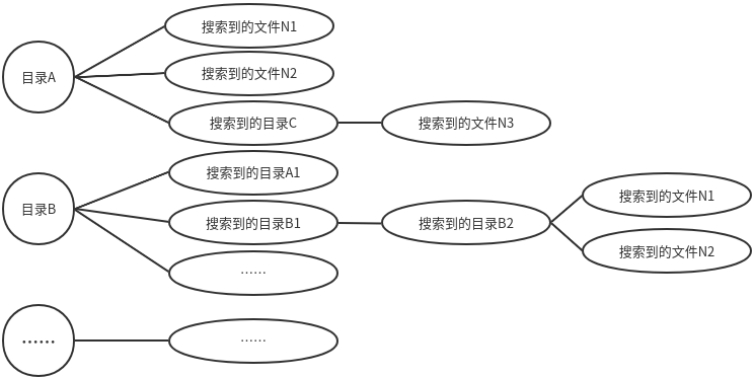

# 一种文件管理器自定义搜索范围和文件的技术交底书

0、缩略语和关键术语定义

无。

 

1、相关技术背景（背景技术），与本发明最相近似的现有实现方案（现有技术）

在当今各类操作系统中，用户对于搜索功能的使用度越来越高，对于快速搜索到指定文件的需求也越来越多。本文主要是针对用户在文件管理器中的任意目录，即可搜索其他任意指定目录或当前目录中的指定文件。

现目前，市面上的操作系统的搜索功能都是只能搜索当前所在的目录，如果用户需要搜索某个文件A和B，但是用户又大概记得这两个文件是在C目录、D目录或者E目录中，这个时候用户就只能分别在这些目录中依次搜索，或者在这些目录的父目录中分两次搜索，就会导致整个过程变得很繁琐且耗时，因此，如何实现文件管理器自定义搜索范围和自定义搜索文件的功能成了当今操作系统一个十分迫切的需求。

1.1、与本发明相关的现有技术

1.1.1、现有技术一的技术方案

目前主流的Windows和UOS操作系统的搜索功能都只能搜索当前所在目录及其子目录下的单个文件，无法自定义搜索范围和文件。

1.1.2、 现有技术一的缺点

目前的主流操作系统的实现方式，均是只能在当前目录及子目录中搜索单个文件，当用户需要同时搜索多个目录和多个文件的时候，就只能在多个目录切换搜索，或者在多个目录的父目录搜索，如果目录很多，文件很多的时候，会使整个过程变得更加繁琐，更加耗时，大量的重复操作对于用户体验来说是极为不好的。

2、本发明技术方案的详细阐述

2.1、本发明所要解决的技术问题

本发明有效解决了文件管理器自定义搜索范围和文件的相关技术问题：

1. 用户在A目录搜索任意文件时，可以自定义搜索当前目录中的任意子目录，比如当前目录中的子目录有B、C、D三个目录，用户可以指定仅在C和D目录中搜索文件；

2. 用户在任意目录搜索文件时，可以自定义任意盘符，自定义单个或多个搜索目录，以及自定义单个或多个搜索文件，目录名和文件名均支持模糊搜索；

2.2、本发明提供的完整技术方案

在本发明中，核心部分技术方案是创建一个搜索目录缓存结构体记录搜索结果中的目录信息，创建一个搜索文件缓存结构体记录搜索结果中的文件信息。对于自定义搜索功能分为三个部分：第一部分是用户选择自定义搜索，选择需要搜索的盘符，输入需要搜索的目录名、文件名；第二部分是用户确认搜索后，自定义搜索将盘符和目录信息发送给搜索引擎，将搜索引擎返回的结果生成并记录在搜索目录缓存中，记为C1；第三部分是将C1中的目录信息和自定义搜索中的文件信息，再次共同发给系统的搜索引擎，将搜索引擎返回的结果生成并记录在搜索文件缓存中，记为C2，最后将C1和C2中的信息展示出来，概要步骤如下所示：

1. 用户在任意目录启用自定义搜索，可以通过文件管理器工具栏上的自定义搜索按钮或快捷键启用；

2. 用户选择需要搜索的盘符，填写需要搜索的目录、文件名后，用户点击搜索，自定义搜索会先将盘符和目录信息发送给搜索引擎；

3. 待搜索引擎返回目录搜索结果后，将会生成C1，并将目录结果记录在其中；

4. 自定义搜索再次将C1中的目录信息和待搜索的文件名信息发送给搜索引擎，待搜索引擎返回文件搜索结果后，将会生成C2，并将结果记录在C2中，自定义搜索读取搜索C1和C2中的信息，分类展示搜索结果；

5. 当用户退出自定义搜索后，内存中创建的C1、C2均会自动被清除；

对应的流程图如下图1 所示，其中蓝色框为核心保护部分：

 

图1 流程图

 

2.2.1、自定义搜索方式描述

当用户点击文件管理器的自定义搜索按钮或快捷键启用自定义搜索后，文件管理器展开自定义搜索的搜索框，其中盘符用户可以手动选择，目录名、文件名需要用户手动输入，其中盘符、目录名、文件名均支持为空，但文件名和目录名至少需要一个有信息输入，另外是否模糊搜索和是否仅搜索当前目录也由用户手动选择，用户还可以点击增加搜索信息框，如下图2所示：

 

图2 用户激活自定义搜索状态图

当用户点击增加搜索框按钮后，就会增加一排搜索框，每排搜索框中的每项均不互相干扰，每排搜索框之间也不互相干扰，每个目录名、文件名输入框旁的模糊搜索选项仅对当前输入框有效，每排中的仅搜索当前目录选项仅对当前排生效，如下图3所示：

 

图3 用户点击自定义搜索增加按钮状态图

当用户选择仅当前目录时，当前搜索行的盘符则不可选择，以下为用户未选择仅当前目录搜索，搜索盘符范围的情况说明：

1、盘符未选择时，则代表搜索的盘符范围为当前设备中的所有盘符；

2、盘符已选择时，则代表搜索的盘符范围为选择的盘符；

以下为目录名和文件名是否为空，且是否选择模糊搜索的情况说明：

1、目录名为空，文件名未选择模糊搜索，仅搜索文件名与输入文件名相同的文件；

2、目录名为空，文件名选择模糊搜索，仅搜索包含文件名的文件；

3、文件名为空，目录名未选择模糊搜索，仅搜索目录名与输入目录名相同的目录；

4、文件名为空，目录名选择模糊搜索，仅搜索包含目录名的目录；

5、目录名和文件名均选择模糊搜索时，先搜索包含目录名的目录，然后在搜索到的目录中再搜索包含文件名的文件；

6、目录名和文件名均不选择模糊搜索时，先搜索目录名与输入目录名相同的目录，然后在搜索到的目录中再搜索文件名与输入文件名相同的文件；

2.2.2、搜索目录缓存

当用户进行自定义搜索时，若有盘符和目录信息，则会先将所有的盘符信息、目录信息发送给搜索引擎，待搜索引擎返回结果后，会在内存中生成C1，将搜索到的所有目录结果保存在C1中。

当用户选择仅在当前目录搜索时，若需要搜索目录，则会将搜索范围固定在当前目录下，然后再将搜索范围和目录信息共同发送给搜索引擎，待搜索引擎返回结果后，会在内存中生成C1，并将结果保存在C1中。

当用户选择仅在当前目录搜索时，若不需要搜索目录，仅需要搜索文件时，则会直接生成C1，将当前目录中的所有目录信息保存在C1中。

C1的缓存形式如下图4所示：

 

图4 搜索目录缓存图

2.2.2、搜索文件缓存

完成目录搜索后，自定义搜索会将文件信息和C1中的目录信息再次发送给搜索引擎，待搜索引擎返回结果后，会在内存中创建C2，将搜索到的所有文件结果保存在C2中，C2的缓存形式如下图5所示：

 

图5 搜索文件缓存图

2.2.3、搜索结果展示

待搜索全部完成后，自定义搜索会同时读取C1和C2中的信息，根据文件管理器的规则，直接展示出来。

2.3、本发明技术方案带来的有益效果

本发明技术方案通过增加一个搜索目录缓存和搜索文件缓存，通过存储搜索到的信息实现自定义搜索文件数据的机制，提升用户的使用体验。本发明技术方案依赖性小，通用性强，运行性能高，可用于任何操作系统的自定义搜索解决方案中。

本技术方案还可以增加自定义类型，增加按照文件的时间戳、类型、大小等方式进行搜索，进一步提高系统的实用性。

 

2.4、针对上述技术方案，是否还有替代方案同样能完成发明目的

无

 

3、本发明的技术关键点和欲保护点是什么

本发明的技术关键点是：（1）自定义搜索范围和文件的流程设计与实现；（2）多目录多文件搜索的架构设计。

 

4、附件：

参考文献（如专利/论文/标准等）