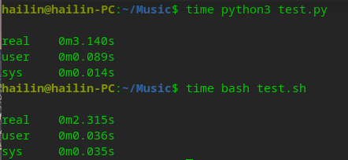
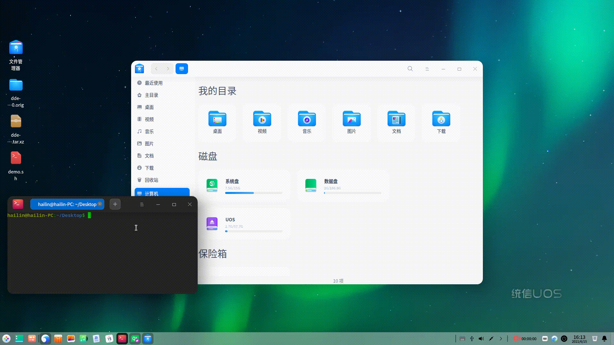

# 应用于桌面应用压力测试的模拟输入工具调研

```shell
# =============================
# Author : 海林
# =============================
```


## 相关术语


|           术语                 | 解释                                        |
| ---------------- |  :----------------------------------: |
|  **InputDevice**  | 支持 linux 管理不同类型、不同原理、不同的输入信息的输入设备软件体系 |
|  **MEM**  |  MEM 是一个内存显示程序，显示所有内存驻留程序的占用情况 |
| **输入子系统** | 输入子系统核心层（Input Core）、驱动层和事件处理层（Event Handler） |

<center style="color:#C0C0C0;text-decoration:underline">表一 术语</center>

## 问题
随着文件管理器（以下简称"文管"）的使用者越来越多，厂商和社区反馈了越来越多反复操作后出现概率概率性 BUG，为了对 BUG 进行复现，就需要进行压力测试。

在我们日常压力测试过程中，文管测试组需要使用现有的设备进行问题复验和场景压测，设备和人力资源有限，因此，在复现和验证这些问题的过程中，存在着如下问题：

1. 耗时巨大，追其原因，是因为在测试过程中，测试复现时反复操作的顺序不同、频率不够、操作慢都可能导致Bug无法复现，整个复现周期相对较长，人力和时间耗费较多。

2. 无可靠性，在遇到概率性 BUG 进行回归的时候，我们无法确定需要测试多少次才能确保问题已修复，而且有可能人力压力测试无法达到复现条件，没有数据支撑测试结论。

因此，探索一种良好的压力测试方案，是迫在眉睫的，可以更准确的验证及回归问题，并且减少人力资源和提升测试效率。

## 现状

基于上述问题，当前市面上对于应用压测存在如下几个方案：

**方案一：使用 Python 脚本进行场景压测**

使用 Python 编写压测脚本，需要使用第三方库 PyAutoGUI 和 Dogtail，PyAutoGUI 是一个纯Python 的 GUI 自动化工具，可以用程序自动控制鼠标和键盘操作模拟用户操作行为，多平台支持（Windows，OS X，Linux）

在编写脚本之前，我们首先需要准备环境，即安装 PyAutoGUI 和 Dogtail 库。


开始编写一个简单压测场景脚本：循环一直新建文件夹。

```python
import pyautogui
for i  in range(10):
    # 鼠标移动到x=100,y=100
    pyautogui.rightClick(100,100)
    pyautogui.click(x=155,y=117)
```

一个场景压测，往往不会这么简单，列举部分文管场景压力测试项如下：

|  压测场景 | 压测步骤 | 压测次数/时长 |
| :------------: | :------------- | :------------: |
| 循环执行创建，删除文件 |1.在桌面/文管空白处，右键菜单<br />2.点击“新建文件夹“<br />3.选择新建文件夹右键”删除“|8H|
| 重复打开 1000 张图片的文件夹 |1.在桌面选择包含 1000 张图片的文件夹<br />2.关闭文管|8H|
| 重复搜索目录中的文件 |1.打开文件管理器，进入test目录中<br />2.点击搜索按钮<br />3.在输入框输入 "test"，进行搜索<br />4.关闭文管|8H|
| 重复同时执行 10 个复制文件任务 |1.在 dock 栏目右键打开 2 个文管窗口<br />2.在 A 窗口中，选择文件右键-复制<br />3.在 B 窗口中，右键粘贴<br />4.快速粘贴 10 次<br />5.删除B窗口的文件|8H|
| 重复向桌面复制文件 | 1.在dock栏目打开文管<br />2.选择一个“音乐”目录  CTRL+C  复制文件<br />3.在桌面粘贴文件<br />4.关闭提示弹窗<br />5.关闭文管 | 8H |

<center style="color:#C0C0C0;text-decoration:underline">表二 压力测试场景</center>

可以很直观的看出，这些测试项的操作都较复杂。

Dogtail 是 Python 的三方库，它使用 Accessbility 技术与桌面应用程序通信。代码通过提前设置好的 Accessbility 标签进行操作，但 Accessbility 标签需要开发人员提前在应用程序中添加，在下图一中看到，1021 的文管中就不存在标签，部分版本基线中该方法并不适用。


<center style="color:#C0C0C0;text-decoration:underline">图一 1021文管Accessbility标签</center>

通过 Dogtail 和 PyAutogui 来控制键盘、鼠标来进行应用的操作，在 Python 代码遍历寻找应用程序上可用的 Accessbility 节点时候，过程需要 1-2S 左右，之后再执行其他操作，这个过程耗时较长，失去了压力测试本身的意义。

纵观整个方案一，缺点是显而易见的，例如无法测试所有的应用版本、无法满足压力测试暴力操作的要求。

**方案二：使用 shell 脚本进行场景压测**

这个方案使用 Xdotool 工具模拟键盘、鼠标操作，Xwininfo 工具来获取窗体属性，此方法通过窗体固有属性，找到对应坐标，之后来进行键盘鼠标操作，整个流程如下图所示：


<center style="color:#C0C0C0;text-decoration:underline">图二  Xdotool和Xwininfo流程</center>

UOS 系统自带了Xdotool和Xwininfo工具，这个方法其实和方案二比较相似，方案二使用 Dogtail 定位元素位置、PyAutoGUI 来操作键盘、鼠标，使用wininfo 获取窗体属性计算坐标，通过 Xdotool 控制键鼠操作。

编写shell脚本，使用 Xodtool 工具进行简单操作，运行代码，查看图三，能看到与上述 Python 脚本同样的操作，shell脚本运行时间接近快了1s。

```bash
#!/bin/bash/
for in  in {0..10}
do
xdotool mousemove 100 100  click 3
xdotool mousemove 155 117  click 1
done
```


<center style="color:#C0C0C0;text-decoration:underline">图三  Python 脚本与 shell 脚本运行速度对比</center>

使用 shell 脚本编写：**重复向桌面复制文件，并且每次输出桌面和文管的窗口 ID(寻找窗口 ID 来获取坐标)** 测试场景，多次运行后，在下图四能看到，同一个场景同一套代码同一个机器，运行结果，极其不稳定，容易报错找不到窗口。


<center style="color:#C0C0C0;text-decoration:underline">图四  xdotool 不稳定</center>

纵观整个方案二：运行环境简单、但是运行结果不稳定。

总结： 现目前这两种方案，各有优劣，都是现阶段较主流的方案，优缺点如表三所示：

| 方案 |                  优点                  |  缺点            |
| :--: | :------------------------------------: | :------------------------------------------------------: |
| 1  |          可自动化、场景覆盖多          | 无法适用所有版本，环境复杂、键鼠操作比较慢达不到压测效果 |
|  2   | 可自动化、运行环境简单，能适用所有版本 |                          不稳定                          |

<center style="color:#C0C0C0;text-decoration:underline">表三 二种方案优缺点总结</center>

在目前的测试环境下，方案一由于 Python 在使用第三方库的时候，程序响应往往都需要 1-2s 时间，运行速度较慢，而且无法满足所有版本的压测需求。方案二使用 shell 脚本编写压测脚本，在运行 Xdotool  工具时候容易出错，Xdotool 工具对键鼠的操作已经算是比较快的工具了，但是在特殊 BUG 上，鼠标操作速度还是有所欠缺，如：异步线程出错，在测试过程中，经常性会遇到这样的小概率问题、同样的操作，有时候能复现问题有时候又不能复现，BUG 复现条件极其苛刻，需要更快的操作增加 复现概率，如下表列举部分的 BUG，在回归 BUG 就需要快速的键鼠操作。

| BUG编号 |描述 | 严重程度 | 优先级 |
| :--: | :----------: | :----------------------: | ---- |
| 29689 |【文件管理器】【5.1.1.63-1】【sp2】桌面空白处右键，选择“壁纸与屏保”，再快速在右键，桌面黑屏 | 2 | 2 |
| 26972 |【文件管理器】【5.1.1.39-1】在列表试图下，快速来回切换排列顺序，再点击上级栏目，文件管理器崩溃 | 2 | 2 |
| 26100 | 【文件管理器】【5.1.1.33-1】4K屏幕，2.75缩放，在桌面空白处快速多次点击右键，桌面崩溃 | 2 | 2 |
| 25591 | 【文件管理器】【5.1.1.31-1】鼠标左右键，快速连续一起按，桌面黑屏 | 3 | 3 |
| 24478 | 【sp1】【文件管理器】【5.1.0.8-1】拖动文件到其他目录下，快速敲击键盘“ctrl+z”出现不正确提示 | 4 | 4 |
| 21172 |   【文件管理器】【5.1.0.8-1】左侧栏目快速切换，右键闪退。    | 2 | 2 |


<center style="color:#C0C0C0;text-decoration:underline">表四 BUG 列表</center>

因此，我们需要对方案二进行优化，找到能解决**键鼠操作速度不够快**和**容易出错不稳定**的方案。


## 技术方案

在用户使用桌面应用时候，都是通过键盘与鼠标输入设备与软件交互。

我们对现状中的方案二进行优化，也参考了 Xdotool 和 Xwininfo 工具的逻辑，设计一款新的应用程序，程序名称为 **app-wininfo-m**，计划解决上述**键鼠操作速度不够快**和**容易出错不稳定**的问题。

对于**键鼠操作速度不够快**的问题，了解到 Linux **输入子系统**，可以通过**设备驱动程序**写入键鼠事件驱动设备文件来对 USB 键盘输入和鼠标移动进行操作。

一个输入事件，如鼠标移动或者键盘按键事件，到达用户空间传给应用程序，如下图四流程


<center style="color:#C0C0C0;text-decoration:underline">图五  输入事件响应流程</center>

事件处理层为不同类型硬件提供了用户访问及处理接口。在 /dev/input 目录下显示的是已经注册在内核中的设备编程接口，用户通过 open 这些设备文件来打开不同的输入设备进行硬件操作，当打开设备 /dev/input/mice 时，会调用到事件处理层的 Mouse Handler 来处理输入事件，这也使得设备驱动层无需关心设备文件的操作，因为 Mouse Handler 已经有了对应事件处理的方法。

对于**容易出错不稳定**的问题，是 Xdotool 这个工具在经过长时间运行后获取窗口 ID 值出错，目前我们能接触到的 UOS 系统图形化界面都是基于  X11 协议，**Xlib** 是 X11 协议的 API 实现，另外用于代替 Xlib 的新型 API 为 XCB。下图五 Xlib 告诉我们每个窗口和像素图都有自己的坐标系，通过坐标系的位置，可以鼠标定位操作应用。


<center style="color:#C0C0C0;text-decoration:underline">图六 xlib 窗口说明</center>

### 整体设计

**app-wininfo-m** 自上而下的模块结构呈现如下图七：


<center style="color:#C0C0C0;text-decoration:underline">图七  app-wininfo-m 模块结构</center>

当按照这种模式设计，每个业务都比较统一有序和模块化，再扩展其他功能更加方便，不会影响到原有的功能。

- **keyboard-event**：处理用户传入类型为 EV_KEY 的事件，将事件写入到 “/dev/input” 目录下的键盘设备文件中，上报事件和同步给 input 子系统中。
- **mouse-event**：处理用户传入类型为 EV_REL 的事件，将事件写入到 “/dev/input” 目录下的鼠标设备文件中，上报事件和同步给 input 子系统中。
- **mouse-position**：基于 xlib 实现获取鼠标的位置，给 app-action 层提供数据支持，监视鼠标的位置变化。
- **app-attribute**：提供一个基于 xlib 获桌面应用窗口属性的集合，具体需要其他的接口，可根据实际需要自由扩展。

**app-action** 的设计理念是一个  wrapper，从功能需求上来看，app-action  提供以下功能：

- **坐标**：主要业务是窗口坐标和鼠标指针位置的获取，根据用户传入的 PID 查到应用的窗口ID，获取窗口属性。
- **键鼠**：主要业务是对设备驱动文件写入键鼠事件，来进行鼠标移动、点击和键盘输入。

**app-wininfo-m**程序运行流程如下：

```mermaid
sequenceDiagram
	应用 ->> 坐标 :传入应用的进程、窗口 id
	坐标 ->> 键鼠 : 通过进程、窗口 id 获取窗口属性
	键鼠 -->> 应用 :通过坐标信息，控制键盘鼠标操作应用
```

对应用使用者提供了友好的说明文档，程序已经帮助实现了需要的操作，使用者只需要根据说明文档传入对应的参数，执行需要的操作。以及添加简单崩溃的断言服务，通过对 coredump 日志监控，判断经过压力测试的应用是否出现崩溃现象，并输出结果提供给测试人员。

### 关键技术

#### 坐标服务

在坐标获取业务中，获取不同应用的坐标位置，在之前我们获取坐标的方式是通过 Xdotool 获取到Window_ID，再通过 Window_ID 使用工具 Xwininfo 获取坐标。需要进行多个步骤操作后才能获取到坐标，在代码编写上步骤复杂，而且获取的结果不够稳定，因此找到了一个获取坐标的新方法，基本操作流程如下：

根据应用的进程寻找应用的坐标位置：

​	传入的 PID，再调用 **app-wininfo-m** 程序，如果 PID 不存在，则不会返回窗口的坐标等属性，如果 PID 存在，就返回窗口的坐标等属性。

  ```mermaid
   graph TD
   A(开始)-->B(读取传入的进程)
   B-->C(判断PID是否存在?)
   C-->|是|D[根据进程PID查找窗口属性]
   D-->E(反回窗口的坐标等属性)
   C-->|否|G[不会返回窗口的坐标等属性]
   E-->F(结束)
   G-->F(结束)
  ```
在编码过程中，获取窗口的坐标引入 Xlib 的头文件 #include <linux/xlib.h> 获取结构体：**XGetWindowAttributes()** 函数返回指定窗口到当前属性 **XWindowAttributes** 结构。

   ```c
// 获取窗口的属性
extern Status XGetWindowAttributes(
    Display*		/* display */,
    Window		/* w */,
    XWindowAttributes*	/* window_attributes_return */
);
// ...

// 窗口的属性详细信息
typedef struct {
    int x, y;			/* location of window */
    int width, height;		/* width and height of window */
    int border_width;		/* border width of window */
    int depth;          	/* depth of window */
    Visual *visual;		/* the associated visual structure */
    Window root;        	/* root of screen containing window */
#if defined(__cplusplus) || defined(c_plusplus)
    int c_class;		/* C++ InputOutput, InputOnly*/
#else
    int class;			/* InputOutput, InputOnly*/
#endif
    int bit_gravity;		/* one of bit gravity values */
    int win_gravity;		/* one of the window gravity values */
    int backing_store;		/* NotUseful, WhenMapped, Always */
    unsigned long backing_planes;/* planes to be preserved if possible */
    unsigned long backing_pixel;/* value to be used when restoring planes */
    Bool save_under;		/* boolean, should bits under be saved? */
    Colormap colormap;		/* color map to be associated with window */
    Bool map_installed;		/* boolean, is color map currently installed*/
    int map_state;		/* IsUnmapped, IsUnviewable, IsViewable */
    long all_event_masks;	/* set of events all people have interest in*/
    long your_event_mask;	/* my event mask */
    long do_not_propagate_mask; /* set of events that should not propagate */
    Bool override_redirect;	/* boolean value for override-redirect */
    Screen *screen;		/* back pointer to correct screen */
} XWindowAttributes;
// ...
   ```

了解到 Xlib 函数，就可以围绕 XGetWindowAttributes() 函数来获取窗口属性，经过以下流程，就完成窗口的属性获取了。

- 传入进程判断，获取窗口，伪代码如下

  ```c
  // Get the PID property atom 获取PID属性atom
  _atomPID = XInternAtom(display, "_NET_WM_PID", True);
          if(_atomPID == None)
          {
              cout << "No such atom" << endl;
              return;
          }
  // ...
  
  // Get the PID for the current Window.获取当前所有窗口的PID。
  void searchmywindow(window w){
          Atom           type;
          int            format;
          unsigned long  nItems;
          unsigned long  bytesAfter;
          unsigned char *propPID = 0;
          if(Success == XGetWindowProperty(_display, w, _atomPID, 0, 1, False, XA_CARDINAL,
                                           &type, &format, &nItems, &bytesAfter, &propPID))
          {
              if(propPID != 0)
              {
              // If the PID matches, add this window to the result set.
              //如果PID匹配，则将此窗口添加到result中。
                  if(_pid == *((unsigned long *)propPID))
                      _result.push_back(w);
  
                  XFree(propPID);
              }
          }
      }
  ```

- 对鼠标进行移动点击，程序要知道鼠标的位置，获取鼠标位置的代码如下：

  ```c++
  //获取鼠标坐标 
   Display *display = XOpenDisplay(NULL);
   Window root = XDefaultRootWindow(display);
   Window root_return;
   Window child_return;
   int root_x_return;
   int root_y_return;
   uint32_t mask_return;
  
    if (::XQueryPointer(display, root, &root_return, &child_return, &root_x_return, &root_y_return, &win_x_return, &win_y_return, &mask_return) == True)
       { //输出鼠标的属性
           qWarning()<<"Window_ID:"<<child_return<<"x:"<<win_x_return<<"y:"<<"win_y_return";
       }
   XCloseDisplay(display);
  ```

- 窗口属性的获取，伪代码如下:
```c++
Window get_toplevel_parent(Display * display, Window window)//获取父窗口ID
{
     Window parent;
     Window root;
     Window * children;
     unsigned int num_children;

     while (1) {
         if (0 == XQueryTree(display, window, &root,&parent, &children, &num_children)) {
             fprintf(stderr, "XQueryTree error\n");
             abort(); 
         }
         if (children) { 
             XFree(children);
         }
         if (window == root || parent == root) {
             return window;
         }
         else {
             window = parent;
         }
     }
}

void getwindowattribute(Window w){
	//获取窗口的属性
    Display *display;
    Window  focus,toplevel_parent_of_focus;
    XWindowAttributes attr;
    int revert;
    display = XOpenDisplay(NULL);
    XGetInputFocus(display, &w, &revert);
    toplevel_parent_of_focus = get_toplevel_parent(display, w);
    XGetWindowAttributes(display, toplevel_parent_of_focus, &attr);
    qWarning()<<"width:"<<attr.width<<"height:"<<attr.height<<"x:"<<attr.x<<"y:"<<attr.y;
	XCloseDisplay(display);
}
```
#### 操作服务

在 Linux 系统中，万物皆文件，我们的键盘和鼠标都是设备文件，经过调研，通过对设备文件写入，就可以对键盘和鼠标进行操作，这个操作是硬件操作的最快的方法，其基本流程如下：

   ```mermaid
   graph TD
   A(开始)-->B(查找设备文件)
   B-->C(打开设备文件)
   C-->D(写入设备文件)
   D-->E(同步写入事件)
   E-->F(事件执行)
   F-->G(结束)
   ```

在编码过程中，对设备文件写入生效，需要引入子系统头文件 #include <linux/input.h> 获取到结构体：

```c
struct input_event {
#if (__BITS_PER_LONG != 32 || !defined(__USE_TIME_BITS64)) && !defined(__KERNEL__)
	struct timeval time;
#define input_event_sec time.tv_sec
#define input_event_usec time.tv_usec
#else
	__kernel_ulong_t __sec;
#if defined(__sparc__) && defined(__arch64__)
	unsigned int __usec;
	unsigned int __pad;
#else
	__kernel_ulong_t __usec;
#endif
#define input_event_sec  __sec
#define input_event_usec __usec
#endif
	__u16 type;
	__u16 code;
	__s32 value;
};
```

通过 write() 函数对 /dev/input 目录下设备文件写入，伪代码如下：

```c++
//fd:打开的文件设备文件
void Move_mouse(int fd, int rel_x, int rel_y)
{
    struct input_event event;
    //x轴坐标的相对位移
    event.type = EV_REL;
    event.value = rel_x;
    event.code = REL_X;
    write(fd, &event, sizeof(event));
    //y轴坐标的相对位移
    event.type = EV_REL;
    event.value = rel_y;
    event.code = REL_Y;
    write(fd, &event, sizeof(event));
    //同步
    event.type = EV_SYN;
    event.value = 0;
    event.code = SYN_REPORT;
    write(fd, &event, sizeof(event));

}
```

最终，通过公式移动到鼠标想要的位置，如移动到应用左上角的位置（ X1，Y1 ），鼠标位置（ X2，Y2 ），鼠标相对位置 rel_x，rel_y 相对移动位置。

 ```c++
	rel_x = X2 - X1;
	rel_y = Y2 - Y1;
 ```

对于键盘的操作，与上面操作类似，就需要修改参数，代码如下：

```c++
//fd:打开的文件设备文件 kval：键盘按键
void simulate_key(int fd, int kval)
{
         struct input_event event;
         gettimeofday(&event.time, 0);
         event.type = EV_KEY;
         event.value = 1;
         event.code = kval;
         write(fd, &event, sizeof(event));
       //同步，报告给系统

         event.type = EV_SYN;
         event.value = 0;
         event.code = SYN_REPORT;
         write(fd, &event, sizeof(event));
         memset(&event, 0, sizeof(event));
         gettimeofday(&event.time, 0);
         event.type = EV_KEY;//松开kval键
         event.value = 0;
         event.code = kval;
         write(fd, &event, sizeof(event));

       //同步，报告给系统

       	event.type = EV_SYN;
      	event.value = 0;
       	event.code = SYN_REPORT;
       	write(fd, &event, sizeof(event));

}
```


## 实验验证

根据技术方案调研的结果，需要对整体设计的方案和一些技术细节进行验证，为此设计以下实验：

### app-wininfo-m 可行性和兼容性验证

app-wininfo-m 的目的是对桌面应用坐标定位，通过输入设备的设备文件操作鼠标键盘，本次实验将按照**整体设计**中的方式，生成一个可以运行的程序执行文件，以**通过进程获取到应用坐标，并且鼠标点击关闭窗口**为例进行演示。

app-wininfo-m 应用程序参数文件说明：

| 参数 |                             说明                             |
| ---- | :----------------------------------------------------------: |
| -m   | 鼠标移动位置，参数一：坐标Ｘ轴，参数二：坐标Ｙ轴，参数三：１点击鼠标左键，２鼠标中键，３鼠标右键 |
| -p   | 通过传入的进程号查找应用窗口的属性，查看所有进程下的窗口，并输出窗口属性 |
| -k   |             键盘输入，如：`-k  KEY_A`，键盘输入A             |

<center style="color:#C0C0C0;text-decoration:underline">表五 app-wininfo-m参数文件说明</center>

【实验环境】

- 系统：UOS 20 1030
- 架构：X86 、ARM64、MIPS64EL

【实验步骤】

- 安装环境

1. app-wininfo-m 代码编写完毕，在 Qt Creator 中构建制执行文件为 demo。

- 编写测试脚本

  使用 shell 方式来运行 demo 程序，编写的代码如下

```shell
#!/bin/bash
file_pid=pidof "dde-file-manager" 	#获取文管进程pid
window_PP=`./demo -p $file_pid` 	#获取输出应用窗口属性
window_W=`echo ${window_PP#*"width:"}|awk -F 'X' '{print $1}'` 	#截取窗口属性宽
window_H=`echo ${window_PP#*"height:"}|awk -F ')' '{print $1}'`	#截取窗口属性高
window_X=`echo ${window_PP#*"x:"}|awk -F 'y' '{print $1}'`	#截取窗口属性x轴坐标
window_Y=`echo ${window_PP#*"y:"}`	#截取窗口属性Y轴坐标
./demo -m $[ window_X + window_W -5 ] $[ window_Y + 5 ] 1	#鼠标移动到关闭按钮位置，并点击关闭按钮
```

- 运行结果

查看下图运行结果，看到 **通过进程获取到应用坐标，并且鼠标点击关闭窗口** 演示操作的例子完美运行成功，**app-wininfo-m** 程序的整体方案是正确的。



<center style="color:#C0C0C0;text-decoration:underline">图八 demo运行结果</center>

以上述例子运行，进行不同系统架构测试，测试结果如下：

| 系统架构 | 测试结果 |
| :------- | -------- |
| MIPS64EL | 正常运行 |
| X86      | 正常运行 |
| ARM64    | 正常运行 |
<center style="color:#C0C0C0;text-decoration:underline">表六 兼容性运行结果</center>


### app-wininfo-m 稳定性验证

压力测试对稳定性要求很高，设计以下测试项，对 app-wininfo-m 程序的关键点进行稳定性验证。

| 测试项                                   | 测试说明                                               | 时长 | 结果 |
| ---------------------------------------- | ------------------------------------------------------ | ---- | ---- |
| 获取10个应用窗口属性                     | 打开多个10个应用，对10个窗口属性获取，demo程序稳定     | 24H  | 通过 |
| 同一个应用打开10个窗口，获取所有窗口属性 | 选择文管，打开10个窗口，获取10个窗口属性，demo程序稳定 | 24H  | 通过 |
| 鼠标移动                                 | 使用demo控制在桌面随意移动，demo程序稳定               | 24H  | 通过 |
| 长时间获取鼠标位置                       | 桌面随机一定，一直获取鼠标位置，demo程序稳定           | 24H  | 通过 |
| 点击鼠标左键                             | 使用demo程序，鼠标随机一直标右键，demo程序稳定         | 24H  | 通过 |
| 点击鼠标右键                             | 使用demo程序，鼠标随机一直标左键，demo程序稳定         | 24H  | 通过 |
| 键盘输入                                 | 使用demo程序，控制键盘一直输入，demo程序稳定           | 24H  | 通过 |

<center style="color:#C0C0C0;text-decoration:underline">表七 稳定测试项</center>

经过上面的测试项，demo 程序满足了稳定性


### app-wininfo-m 操作性能验证

demo 程序在设计当初考虑了极限的压力操作场景，准备了一下实验，进行验证结果，代码如下：

```shell
for i  in {1..10}
do
    ./demo -m 100 100 3
    ./demo -m 155 117 1
done
```

使用 time 命令运行 shell 脚本，下图就是 demo 程序运行速度。


<center style="color:#C0C0C0;text-decoration:underline">图九 demo运行速度</center>

由上图九可知 demo 程序运行速达到 1.844s，对比方案二的 2.315s 速度，明显超过 Xdotool 工具的运行速度。


## 小结

本文针对压力测试工具提出技术方案，**整体设计**中通过对设备文件写入操作和使用 xlib 库开发了定位和操作服务，解决了方案二获取坐标不稳定和操作速度不够快的问题，基本上能满足现有压测场景的使用要求，同时提供简单崩溃断言的服务。

**app-wininfo-m** 工具作为我们自己开发的工具，未来可以根据需求进行功能扩展，如在“进行搜索的压力测试”，目前只能验证搜索出现崩溃这样的问题，无法验证搜索结果是否正确，现有市面上仍然没有这样功能的工具，我们可以在 app-wininfo-m 工具中定制开发。

一个新开发工具，往往要经过无数次的版本迭代和优化，接下来的方向，就是对工具进行以下功能扩展和优化。

| 扩展功能                 | 优化                    |
| ------------------------ | ----------------------- |
| 模拟拖拽操作             | 优化鼠标移动计算方式    |
| 元素定位                 | 优化 app-wininfo-m 代码 |
| 图像定位                 | 优化数据输出方式        |
| 增加断言方式（如：搜索） | 优化键盘输入传值方式    |
| 模拟触摸操作             |                         |


## 参考资料

- [xdotool 介绍](https://www.Linux.org/threads/xdotool-keyboard.10528/)
- [xｗininfo 介绍](https://www.x.org/releases/X11R7.7/doc/man/man1/xwininfo.1.xhtml)
- [xlib 介绍](https://www.x.org/releases/X11R7.6/doc/libX11/specs/libX11/libX11.html)
- [input 子系统](https://www.kernel.org/doc/html/v4.17/input/event-codes.html)