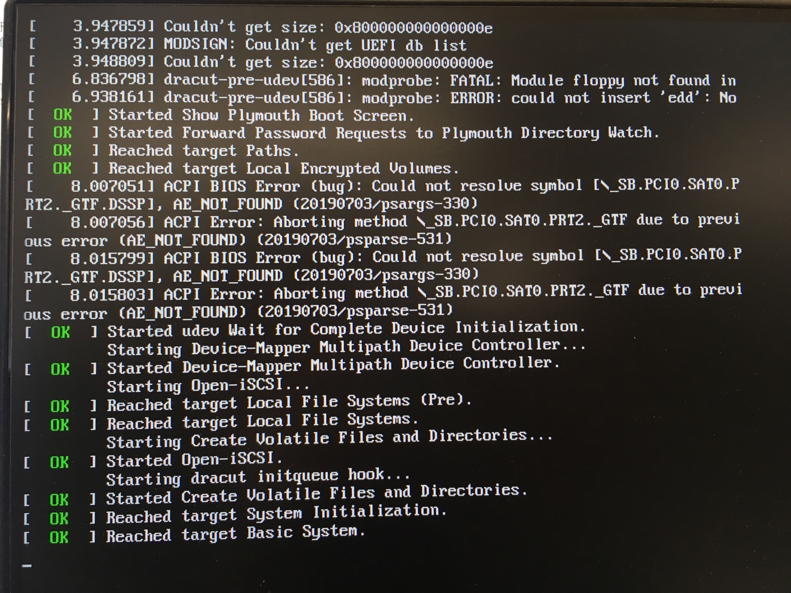
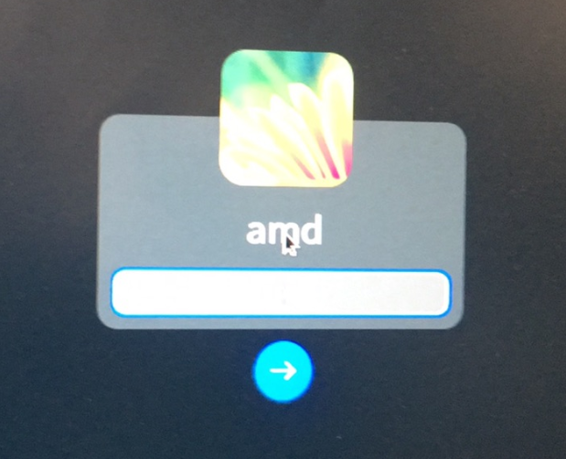
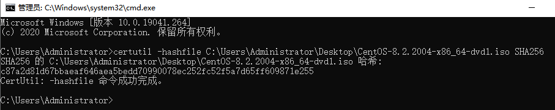
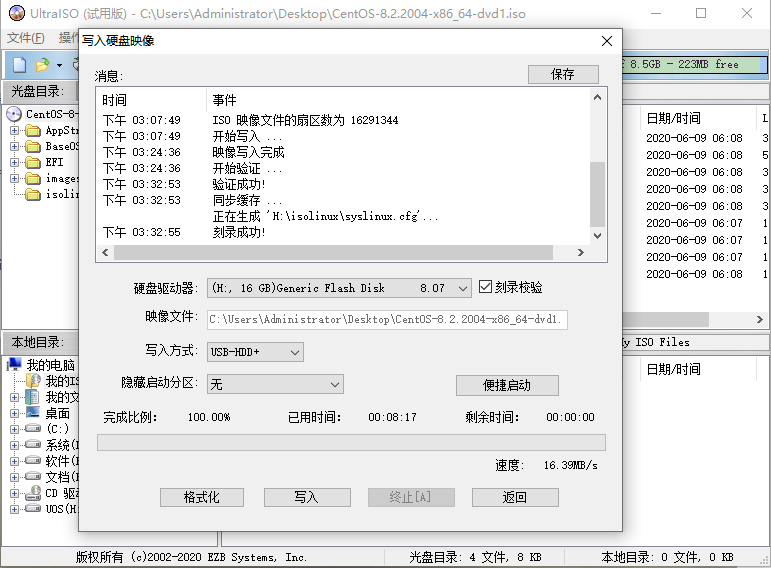
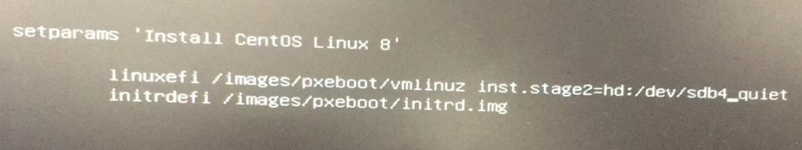
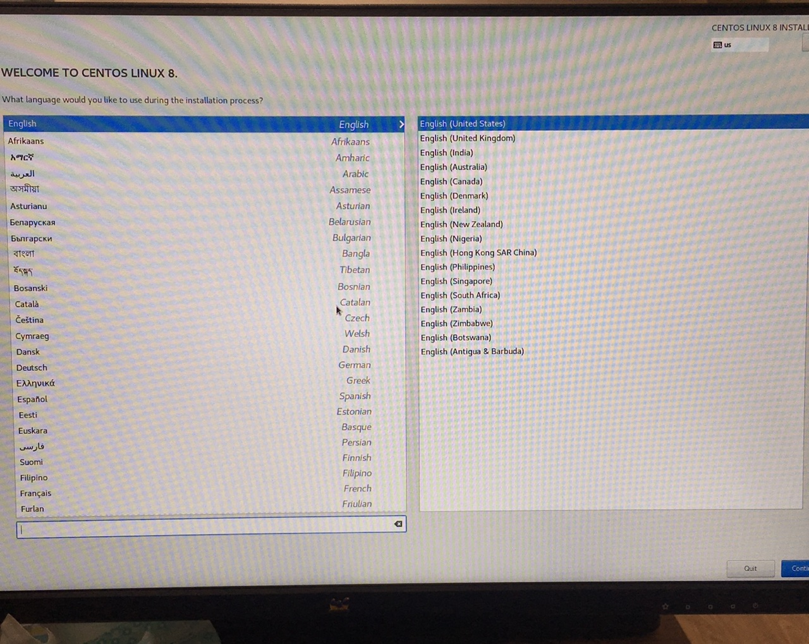
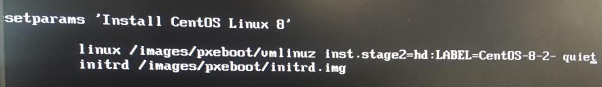
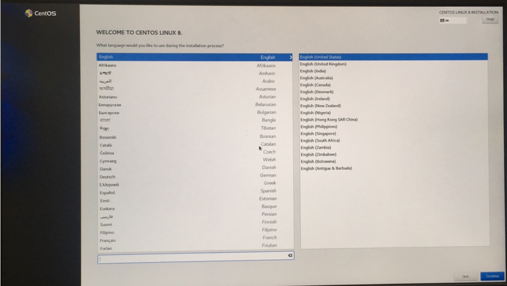

# `CentOS8`U盘安装时无法正常进入安装界面问题根因分析

```shell
# =============================
# Author : 恒强
# =============================
```


## 一、相关术语

| 缩写 | 全称 | 描述 |
| :--: | :--: | :--- |
| GRUB |  GRand Unified Bootloader  | GNU GRUB是一个来自GNU项目的多操作系统启动程序。GRUB是多启动规范的实现，它允许用户可以在计算机内同时拥有多个操作系统，并在计算机启动时选择希望运行的操作系统。 |
| UEFI| Unified Extensible Firmware Interface | **统一可扩展固件接口**（**UEFI**）是一种个人电脑系统规格，用来定义操作系统与系统固件之间的软件界面，作为BIOS的替代方案。 |
| SHA256 | Secure Hash Algorithm | **安全散列算法**（英语：Secure Hash Algorithm，缩写为SHA）是一个密码散列函数家族，是FIPS所认证的安全散列算法。 |
| ACPI | Advanced Configuration and Power Interface | 表示高级配置和电源管理接口（Advanced Configuration and Power Management Interface）。对于Windows2000，ACPI定义了Windows 2000、BIOS和系统硬件之间的新型工作接口。这些新接口包括允许Windows 2000控制电源管理和设备配置的机制。 |

## 二、问题概述

​		在一次进行`CentOS8`微观性能测试时，发现一个问题：使用在`windows10`上制作的`CentOS8`U盘安装器在测试机上安装系统时无法正常进入安装界面。

【复现环境】

​		硬件环境：

​		测试机配置：`测试机`（下文中提到的测试机，均为该测试机）

| 硬件 |                      型号                      | 规格                                                         |
| :--- | :--------------------------------------------: | :----------------------------------------------------------- |
| cpu  |               Intel 酷睿i3 9100F               | Intel(R) Core(TM) i3-9100F CPU @ 3.60GHz (四核 / 四逻辑处理器) |
| 内存 |             CT8G4DFS8266.M8FD DDR4             | 2667MHz (0.4ns)                                              |
| 硬盘 |                 CT240BX500SSD1                 | 240 GB                                                       |
| 显卡 | Oland [Radeon HD 8570 / R7 240/340 / R520 OEM] | 2GB                                                          |

​		U盘：`SanDisk Cruzer Blade 1.26`

​		软件环境：

​		镜像版本：`CentOS-8.2.2004-x86_64-minimal.iso`

​		制作安装器软件：`UltraISO 9.7.3.3629`

​		制作安装器软件运行平台：`windows 10`

【复现步骤】

​		1、在`windows 10`上，使用软件`UltraISO`制作一个`CentOS8`的U盘系统安装器；
​		2、在测试机上使用步骤1已制作完毕的安装器进行系统安装；
​		3、进入到`grub`界面，选择【install CentOS Linux 8】；
​		4、观察现象。

【问题现象】

​		无法正常进入图形化安装界面，停留在如下图所示的页面；


​		此时点击【ESC】,切换到命令行查看提示信息，如下图：



【期望】

​		在`GRUB`界面选择【install CentOS Linux 8】选项后，能够正常进入图形化安装界面。


## 三、问题分析

​		使用U盘安装`CentOS8`系统的流程大致如下：


​		根据U盘安装`CentOS8`系统的流程图，存在以下几种因素可能会影响到系统无法正常进入图形化安装界面，如下：

1. U盘本身存在问题，导致无法正常进入安装界面。
2. 镜像存在问题，导致无法正常进入安装界面。
3. 机器存在问题，导致无法正常进入安装界面。
4. 系统启动的引导方式错误，导致无法正常进入安装界面。
5. 制作U盘的软件出现错误，导致无法正常进入安装界面。

​		因为`UOS`系统也是使用的`UFEI`的方式启动，所以假设能够使用与安装`CentOS8`系统相同的环境，安装正常的`UOS`镜像成功，并且成功进入`UOS`系统桌面，则可以证明问题不是因素1、3、4、5引起的，就继续分析因素2。通过分析验证一的实验结果来判断是否可以排除因素1、3、4、5。


**分析验证一：保持U盘安装`CentOS8`系统相同的环境下，使用U盘安装`UOS`系统能否成功。**

【实验流程】


【实验环境】

​		镜像：`uniontechos-device-20-gui-1010_AMD64-20200827.iso`
​		U盘：`SanDisk Cruzer Blade 1.26` 
​		测试机：`测试机`
​		U盘安装器制作软件：`UltraISO`
​		制作U盘安装器软件运行平台：`windows 10`

【实验设计】

实验操作：

​		操作1：准备系统镜像、U盘、`UltraISO`工具、测试机。

​		操作2：使用`UltraISO`制作U盘安装器。

​		操作3：使用制作好的U盘安装器安装镜像。

​		操作4：启动测试机，验证系统安装是否正常。

实验步骤：

​		`操作1-->操作2-->操作3-->操作4`

实验结果分析：

​		`成功-->问题不是因素1、3、4、5引起`

​		`失败-->问题由因素1、3、4、5引起`


【实验验证】

​		步骤一：实施操作1，将U盘插入`windows10`电脑，安装并运行``UltraISO``软件。


​		步骤二：实施操作2，点击`UltraISO`【打开】按钮，载入`UOS`镜像；点击【启动】-->【写入硬盘映像】-->【写入】-->【确认】；等待U盘制作完成。

​		步骤三：实施操作3，将U盘插入测试机并引导U盘启动，开机键入【F9】，选择U盘启动；选择安装默认项，进入系统安装界面，根据提示信息进行安装；等待安装完成。


​		步骤四：实施操作4 重启测试机，拔出U盘，观察能否正常进入系统。



​		根据实验现象，1号测试机能够正常初始化，初始化完成后，能够正常进入系统登录界面，表明实验结果为成功，则证明了问题不是因素1、3、4、5引起的。

​		接下来继续分析因素2，可以通过`CentOS8`镜像的`SHA256`值来校验镜像的完整性，以此来证明因素2，镜像没有错误，详细情况见分析验证二。


**分析验证二：验证`CentOS8`镜像的`SHA256`值，是否与官方发布的一致。**

【验证流程】


【实验环境】

​		镜像文件：`CentOS-8.2.2004-x86_64-dvd1.iso`

​		比对工具：`certutil -hashfile `

【实验设计】

实验操作：

​		操作1：计算下载后`CentOS8`镜像文件的`SHA256`值。

​		操作2：获取官方镜像文件的`SHA256`值。

​		操作3：比较操作1的`SHA256`值与操作2的`SHA256` 值。

实验步骤：

​		`操作1-->操作2-->操作3`

实验结果分析：

​		`成功：SHA256值一致，因素2不是引起问题的因素`

​		`失败：SHA256值不一致，因素2是引起问题的因素`


【实验验证】

​		步骤1：实施操作1，打开`cmd`字符窗口，执行命令：

```
certutil -hashfile C:\Users\Administrator\Desktop\CentOS-8.2.2004-x86_64-dvd1.iso SHA256
```


​		等待执行结果。



​		由上图可知计算出的`SHA256`的值等于`c87a2d81d67bbaeaf646aea5bedd70990078ec252fc52f5a7d65ff609871e255`

​		步骤二：实施操作2，下载官方镜像的`SHA256` 值文件，链接地址如下：

```
http://mirrors.huaweicloud.com/repository/centos/8.2.2004/isos/x86_64/CHECKSUM
```


​		由上图可知官方的`SHA256`的值等于`c87a2d81d67bbaeaf646aea5bedd70990078ec252fc52f5a7d65ff609871e255`

​		步骤三：实施操作3，比对`SHA256` 值一致。

​		根据实验现象，官方的镜像`SHA256` 与本地计算出的保持一致，说明镜像文件是完整无损的，所以实验结果证明因素2也不是引起问题的因素。

​		根据上述两个分析实验的结果，证明了之前推测的因素1、2、3、4、5均不是引起问题的因素，那现在只能换一个思路，从`CentOS8`的启动流程入手，推测会不会是启动流程中间出现了错误，才导致没法正常进入安装界面呢？`CentOS8`的启动流程如下：


​	（上图只是为了概括下启动流程的各个流程的作用，启动顺序由第一阶段发起，第五阶段结束。）

​		总结一下，`CentOS8`启动大致分为以下5个阶段：

​		第一个阶段：`POST`加电自检，主要是对内部各个设备进行检查。

​		第二个阶段：`BIOS`启动引导，主要是查找启动介质，跳转`EPS`分区，加载`BootLoader`。

​		第三个阶段：`GRUB`启动引导，主要查找/boot、识别文件系统、寻找内核。

​		第四个阶段：内核加载，本阶段主要是将内核加载到内存，内核接管系统后，探测、加载硬件，挂载、切换根文件系统，准备进行系统初始化。

​		第五个阶段：系统初始化，启动 `/usr/lib/systemd/systemd` 进程，读取 `systemd.target` 进行系统运行环境初始化，读取`basic.target`执行基本任务等等。

​		根据问题的现象，在使用U盘安装`CentOS8`时，在`grub`页面选择了启动项后，界面开始黑屏，切换到操作日志界面，发现有报错信息：`ACPI Error`再结合启动流程图分析，目前正好处于第四阶段，本来应该去加载内核，然后内核去探测硬件、加载硬件驱动等等，但是现在却卡住，界面黑屏，并且提示`dracut-pre-udev[586]:modprobe:FATAL`,查询资料后可知，`dracut`是新一代的`initramfs`系统，唯一的作用是挂载`rootfs`，依赖`udev`去获取`rootfs`的设备节点，此时报错，并提示模块未找到等等。此时判断是因为系统没有找到启动设备，所以导致无法进入下一阶段。再根据流程图，可知第二阶段有去查找设备的操作，那现在就应该去检查一下`GRUB`中的启动项配置，会不会因为配置文件错误，导致了这个问题呢？

​		报错信息如下图：


​		为了检查配置文件，进入`grub`界面，选中【Install CentOS linux 8】选项，键入【E】键，跳转启动项配置界面，发现默认项配置中内核命令项`inst.stage2`指向`LABEL=CentOS-8-2-2004-x86_64-dvd`。现在通过修改启动项配置，键入【ctrl + x】，查看系统目前识别到的设备中有没有`LABEL`是`CentOS-8-2-2004-x86_64-dvd`。

​		启动项默认配置如下：


​		查看设备列表的启动项配置：


​		目前系统上已识别的设备表：


​		此时观察设备表，发现第八项为U盘安装器，并且`LABEL`列中也没有`CentOS-8-2-2004-x86_64-dvd`，只有`CentOS-8-2-`，而`CentOS-8-2-`正好是`CentOS-8-2-2004-x86_64-dvd`的前半部分，后半部分疑是被截掉了，通过`UltraISO`工具查看镜像的卷标确实是`CentOS-8-2-2004-x86_64-dvd`，那么在制作U盘安装器的过程中，卷标被保存为了`CentOS-8-2-`，这是为什么呢？查询相关资料得到：`windows`系统的卷标长度是有11个字符的限制。而卷标`CentOS-8-2-2004-x86_64-dvd`太长，被系统自动截取了，导致在内核命令项`inst.stage2`指定的`LABEL`没有找到，所以才出现了该问题。


​		根据目前的分析，可知由于`windows`卷标长度限制的问题，导致U盘制作成功后，卷标与实际的启动配置项中的`LABLE`不一致，导致了系统在内核加载阶段找不到内核启动，出现黑屏，无法进入安装界面的问题。

​	

## 四、实验验证

​		现在提供三个解决方案：

			1. 方案1是通过`DEVICE`指定`sdb4`来加载内核，见实验验证1；
			2. 方案2则是通过`LABEL`指定`CentOS-8-2-`来加载内核，见实验验证2；
			3. 方案3则是在`linux`系统上制作U盘系统安装器，见实验验证3。

**验证1：修改`grub` 启动项，通过`DEVICE`指定`sdb4`来加载内核。**

​		进入`grub`界面，修改启动项，通过`DEVICE`指定`sdb4`来加载内核实验流程如下：


【实验环境】

​		测试机：`测试机`
​		U盘：`SanDisk Cruzer Blade 1.26`
​		U盘安装器制作软件：`UltraISO` 
​		镜像：`CentOS-8.2.2004-x86_64-dvd1.iso`
​		U盘安装器运行平台：`windows 10`


【实验设计】

实验操作：
		操作1：使用``UltraISO`` 制作`CentOS8`的U盘安装器。
		操作2：使用U盘启动进入`grub`界面。
		操作3：修改启动项并执行，指定U盘路径。
		操作4：执行新的启动项。


实验步骤：
		`操作1 --> 操作2 --> 操作3 --> 操作4`


实验结果分析：

​		`成功：正确进入系统安装界面，解决方案通过。`
​		`失败：不能进入系统安装界面，解决方案不通过。`


【实验验证】

​		步骤1：实施操作1，`UltraISO` 打开镜像文件：`CentOS-8.2.2004-x86_64-dvd1.iso`，点击【启动】-->【写入硬盘映像】-->【写入】-->【确认】，等待U盘安装器制作完成。




​		步骤2：实施操作2，将制作好的U盘安装器插入1号测试机，开机时键入【F9】，选择U盘启动，进入`grub`界面。


​		步骤3：实施操作3，根据设备表可知`DEVICE`指定的`sdb4`为U盘，键入【E】进入启动项编辑界面。
修改

```shell
linuxefi /images/pxeboot/vmlinuz inst.stage2=hd:/LABEL=CentOS-8-2-2004-x86_64-dvd quiet
```


为

```shell
linuxefi /images/pxeboot/vmlinuz linux dd inst.stage2=hd:/dev/sdb4 quiet
```



​		步骤4：实施操作4，键入【ctrl + x】运行。运行结果如下图：

​		运行结果：



​		此时已正确进入安装界面，证明该解决方案可以解决U盘安装`CentOS8`，无法进入安装界面的问题。


**验证2：修改`grub`启动项，通过`LABEL`指定`CentOS-8-2-`来加载内核。**

​		进入`grub`界面，修改启动项，通过`LABEL`指定`CentOS-8-2-`来加载内核实验流程如下：


【实验环境】

​		镜像：`CentOS-8.2.2004-x86_64-dvd1.iso`
​		U盘：`SanDisk Cruzer Blade 1.26`  
​		测试机：`测试机`
​		由上文设备表，可知U盘卷标：`CentOS-8-2-`


【实验设计】

实验操作：

​		操作1：将制作好的`CentOS8`U盘启动器，插入测试机。
​		操作2：选择U盘启动。
​		操作3：进入grub界面，编辑启动项。
​		操作4：使用新的启动项进行引导。

实验步骤：

​		`操作1-->操作2-->操作3-->操作4`


实验结果分析：

​		`成功：正确进入系统安装界面，解决方案通过。`
​		`失败：不能进入系统安装界面，解决方案不通过。`


【实验验证】

​		步骤1：实施操作1，将制作好的`CentOS`U盘系统安装器，插入测试机，开启测试机，并键入【F9】，进入`BIOS`引导界面。

​		步骤2：实施操作2，在`BIOS`引导页面，选择【SanDisk Cruzer Blade 1.26】选项，进入grub界面。

​		步骤3：实施操作3，在`grub`界面，键入【E】，进入 启动项配置编辑页面，

​		修改：

```
linuxefi /images/pxeboot/vmlinuz inst.stage2=hd:/LABEL=CentOS-8-2-2004-x86_64-dvd quiet 
```
​		为
```
linuxefi /images/pxeboot/vmlinuz inst.stage2=hd:/LABEL=CentOS-8-2- quiet 
```



​		步骤4：修改完成后，键入【ctrl + x】，使用新的U盘卷标进行引导。观察实验结果。



​		此时已正确进入安装界面，证明该解决方案同样可以解决U盘安装`CentOS8`，无法进入安装界面的问题。


**验证3：在`linux`系统上使用`dd`命令制作U盘系统安装器。**

​		在`linux`系统上使用`dd`命令制作U盘系统安装器流程如下：


【实验环境】

​		镜像：`CentOS-8.2.2004-x86_64-dvd1.iso`
​		U盘：`SanDisk Cruzer Blade 1.26`  
​		测试机：`测试机`
​		制作U盘安装器软件运行平台：`uniontechos-device-20-cli`

【实验设计】

实验操作：

​		操作1：打开`linux`终端，并将U盘插入测试机。
​		操作2：查询U盘的地址。
​		操作3：将镜像文件写入U盘。
​		操作4：使用新制作的U盘安装`CentOS8`系统。

实验步骤：

​		`操作1-->操作2-->操作3-->操作4`

实验结果分析：

​		`成功：正确进入系统安装界面，解决方案通过。`
​		`失败：不能进入系统安装界面，解决方案不通过。`


【实验验证】

​		步骤1：实施操作1，打开`linux`系统，进入终端页面，将U盘插入测试机。

​		步骤2：实施操作2，在终端页面执行命令`sudo fdisk -l`，可知`/dev/sdb4` 为U盘。


​		步骤3：实施操作3，在桌面页面执行命令`sudo dd if=CentOS-8.2.2004-x86_64-dvd1.iso of=/dev/sdb`。


​		步骤4：实施操作4，将U盘插入测试机，启动，选择U盘启动，选择【Install CentOS Linux 8】，观察实验结果。


​		此时正确进入安装界面，证明该解决方案同样可以解决U盘安装`CentOS8`，无法进入安装界面的问题。

​		根据上述三个实验验证，问题的根本原因是在`windows`上使用`UltraISO` 制作`CentOS8`U盘系统安装器的过程中，由于`windows`卷标的长度限制，会截断U盘的卷标，最后才导致使用`CentOS8`的U盘安装器安装时无法正常进入安装界面。


## 五、解决方案

​		根据上述实验结果，确定使用`CentOS`的U盘安装时无法正常进入安装界面的问题产生，是因为在`windows`上使用`UltraISO` 制作`CentOS8`U盘系统安装器的过程中会截断U盘的卷标。为解决这个问题，提供三个解决方案，如下：

**【解决方案一】**

操作步骤：

1. .测试机插入`windows10`下制作的U盘系统安装器，进入grub 界面后，键入【E】键进入启动项配置界面。

2. 修改启动项中卷标`CentOS-8-2-2004-x86_64-dvd`为`CentOS-8-2-`。

3. 键入【ctrl + x】，使用新的配置项引导系统。


**【解决方案二】**

操作步骤：

1. 测试机插入`windows`下制作的U盘系统安装器，进入`grub` 界面后，键入【E】键进入启动项配置界面，修改`linuxefi /images/pxeboot/vmlinuz inst.stage2=hd:/LABEL=CentOS-8-2-2004-x86_64-dvd quiet`为``linuxefi /images/pxeboot/vmlinuz linux dd quiet``。

2. 键入【ctrl + x】，等待设备查询结果，记录U盘所在目录：`/dev/sdb4`。

3. 重启计算机，U盘启动，进入grub界面，键入【E】键进入启动项配置界面，修改`linuxefi /images/pxeboot/vmlinuz inst.stage2=hd:/LABEL=CentOS-8-2-2004-x86_64-dvd quiet`为`linuxefi /images/pxeboot/vmlinuz inst.stage2=hd:/dev/sdb4 quiet`。

4. 键入【ctrl + x】，使用新的配置项引导系统。

   

**【解决方案三】**

操作步骤：

1. 进入`linux`终端页面，并插入U盘后，执行命令`sudo fdisk -l`查询U盘地址。
2. 记录U盘地址，执行命令`sudo mkfs.ext4 /dev/sdb4`格式化U盘。
3. 格式化U盘完成后，执行命令`sudo dd of=/images/CentOS-8.2.2004-x86_64-dvd1.iso if=/dev/sdb bs=2M`制作U盘系统安装器。
4. 将U盘插入测试机，启动，选择U盘启动，选择【Install CentOS Linux 8】。


**解决方案的优劣比较**

| 解决方案编号 | 适用场景                       | 优势                   | 劣势                           |
| :----------- | ------------------------------ | :--------------------- | ------------------------------ |
| 1            | 已在`windows10`上制作U盘安装器 | 步骤相对较少，耗时短   | 无法自动进入安装界面           |
| 2            | 已在`windows10`上制作U盘安装器 | 泛用性高，不受卷标限制 | 无法自动进入安装界面，步骤繁杂 |
| 3            | 未制作U盘安装器                | 自动进入安装界面       | 耗时较长，且未验证镜像完整性   |

​		综上所述，最优的解决方案是方案1：修改`grub`启动项，通过`LABEL`指定的`CentOS-8-2-`来加载内核。当然在没有制作U盘安装器时，在`linux`系统上使用`DD`命令制作`CentOS8`的U盘安装器能够避免该问题的出现。

## 六、小结

1.  问题总结：

​		在测试机上使用U盘安装`CentOS8`时无法进入安装界面的问题，是因为在`windows`上使用`UltraISO` 制作`CentOS8`U盘系统安装器的过程中会截断U盘的卷标，在使用U盘安装`CentOS8`时，安装启动项的默认配置`LABEL`指定的名称与U盘的`LABEL`并不匹配，导致了没有找到启动介质，在启动内核加载的阶段，无法加载内核，所以不能正常进入安装界面。解决问题的关键步骤是重新修改了`grub `里面的`LABEL`默认启动项，重新指定内核目录。

2. 最优解：

​		提供了三种解决方案，如果是还没有制作U盘启动器，推荐方案3，避免无法正常进入安装界面问题的出现；如果已经在`windows10`上制作了U盘启动器，推荐方案1。

3. 进阶方案：

​		可知问题出现的原因是镜像的自带卷标太长，可以通过拆解镜像包的方式，修改卷标和启动项配置文件中卷标为`CentOS8`，再重新打包，使用新包制作U盘启动器，在安装时就能自动进入安装界面。

4. 收获与启示：

​		启示：分析问题的时候，应该尽可能的去列举它的产生因素。根据问题的因素去设计相关的验证方法，尽快排除无关因素。遇到棘手的问题，应该从多个角度去了解它背后的知识，有助于我们从多个方向去解决它。

​		收获：`windows`系统的卷标长度是有11个字符的限制，`linux`系统对卷标长度没有限制。以后在制作U盘安装器的时候也要关注一下卷标的长度，尽量使用在`linux`上制作U盘系统安装器，以此来规避类似的问题。

​		

## 七、参考资料

- [图解CentOS系统启动流程](https://zhuanlan.zhihu.com/p/52104218)
- [Linux系统启动过程分析](https://www.cnblogs.com/bluestorm/p/5981435.html)