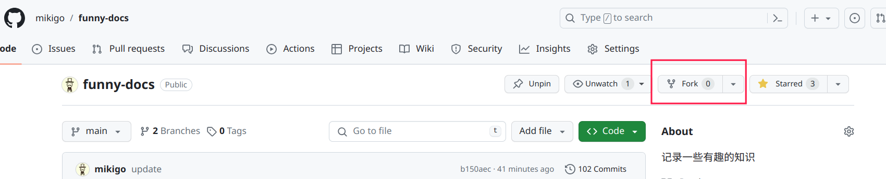
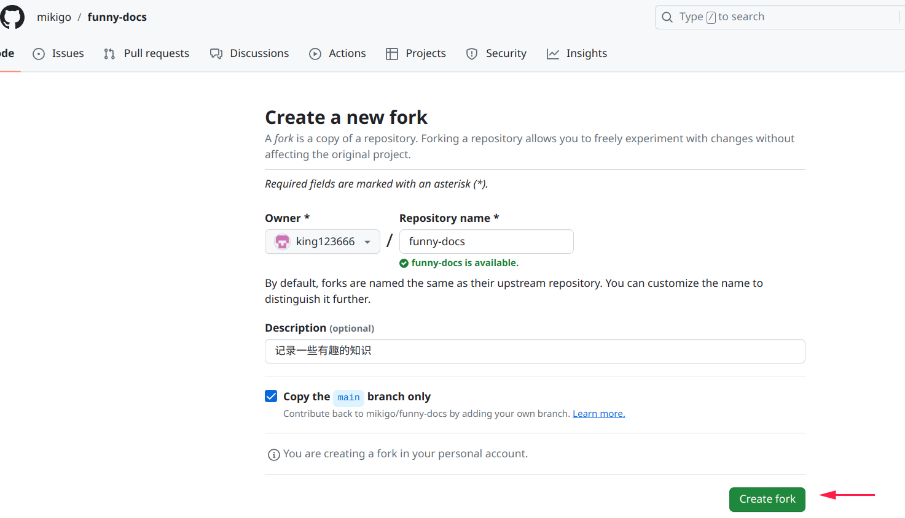
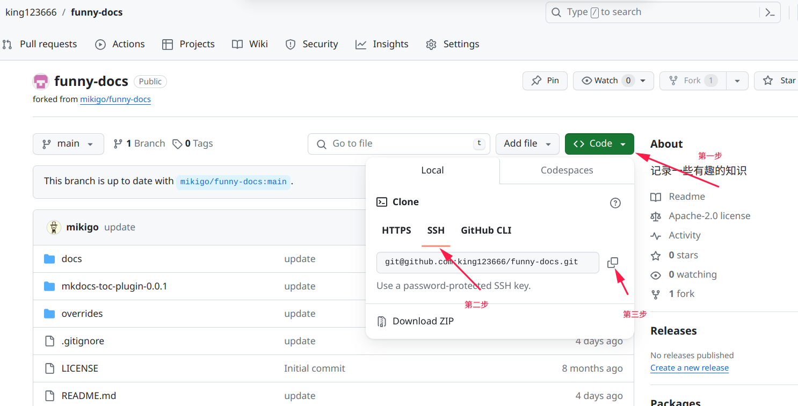
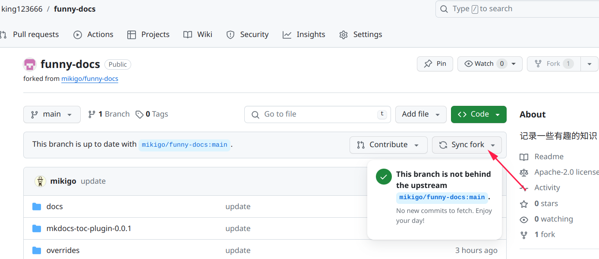
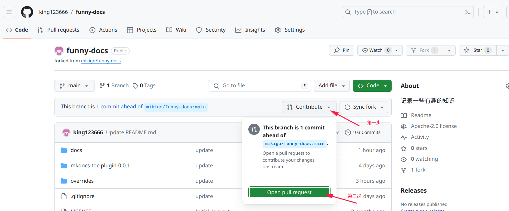
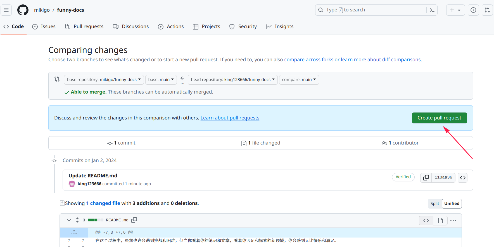
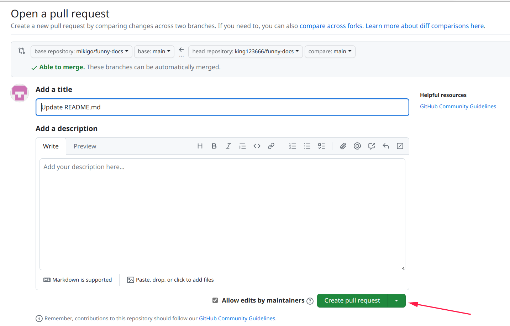
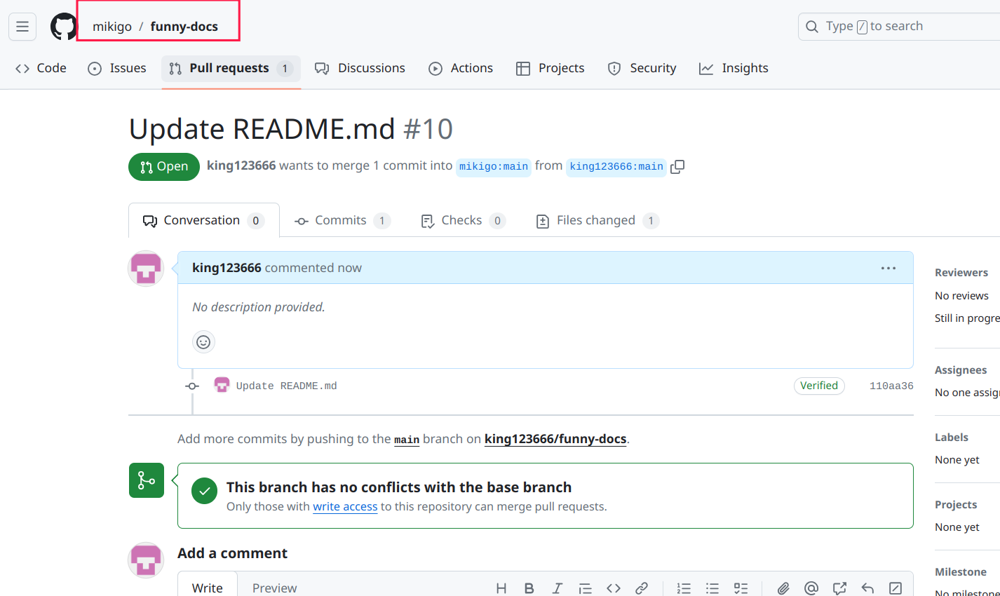
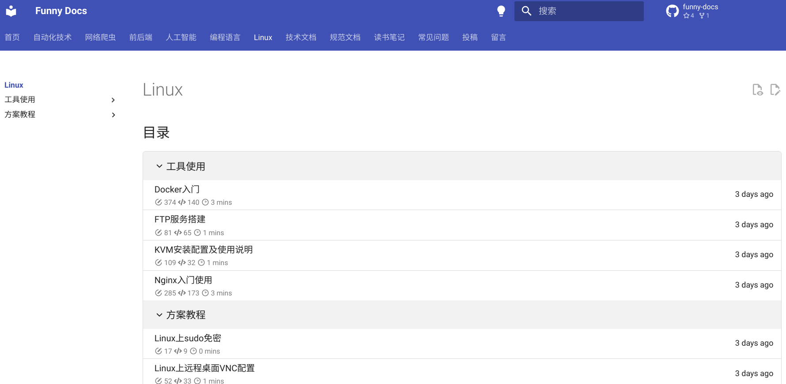

# 投稿

文档工程使用 `Github` 管理，投稿走 `PR` 流程；

## PR（Pull Request）流程

### 1. Fork 文档仓库

点击网站右上角 `funny-docs` 图标： 或者也可以直接访问地址：[https://github.com/mikigo/funny-docs](https://github.com/mikigo/funny-docs) 进入到文档工程仓库；

然后用你自己的 `GitHub` 账号登录

点击右上角的 `Fork` 按钮：



然后不用想，直接戳这里：



稍等片刻，就把此仓库 `Fork` 到你的 `GitHub` 中了；

### 2. 克隆这个 Fork 的项目

将你自己的 `Github` 中 `Fork` 的这个项目克隆下来：



终端输入：

```shell
git clone git@github.com:king123666/funny-docs.git
```

其中 `git@github.com:king123666/funny-docs.git` 可以直接用从网站上复制的；

不出意外的话就把仓库拉到本地了；

### 3. 提交PR

上一步之后本地就有文档工程，之后你就可以在里面新增或修改文档，这部分由于涉及到一些技巧和规范，我在后面单独开了一章来讲解；

提交你的新增或修改的内容到 Fork 仓库：

#### 3.1 同步 Fork 仓库

在你 `Fork` 的仓库右上角点这里：



确保 Fork 的仓库和原仓库保持同步；

#### 3.2 提交 Github

在 `~` 目录下新建文件，并命名为 `gitcommit_template`

将以下内容写入文件当中：

```shell
# commit type :fix（问题修复）、feat（功能开发）、style(风格修改)、refactor(重构)、docs（文档）、chore（其他)、test(测试) + 简单描述. 默认fix,根据情况修改
fix: 

# 详细说明代码的改动，包含代码的实现思路，以及为什么这么做，可能会影响哪些功能。对于代码的审核者，需要从这段描述中能完全理解代码中所有改动的内容
Description: 

# 写一段面向于产品的总结性内容，用于自动生成crp上的changlog，需要注意的事，这段描述必须从产品的角度考虑。
Log: 

# 关联pms上的bug号，提交后，则会自动在pms对应bug信息页面添加备注，关联本次提交。若本次提交为修复bug相关，则请取消注释
#Bug: 

# 修复 github issue 
#Issue: 

# 关联pms上的任务号，提交后，则会自动在pms对应任务信息页面添加备注，关联本次提交。若本次提交为任务相关，则请取消注释
#Task: 
```

命令行执行:

```
git config --global commit.template ~/gitcommit_template
```

此命令将模板加入到 `git` 的提交模板中。

添加 `commit` 信息

```shell
git add 后面加文件名称
git add . # 表示添加所有文件
```

使用这条命令注意有些临时文件不要提交到仓库了。

```shell
git commit -a
```

之后在 `fix:` 后面（注意冒号后面必须加空格）写本地提交的 `commit` 信息，然后就可以提交代码了

```shell
git push
```

这样就把你新增或修改的内容提交到你 Fork 的仓库中了；

#### 3.3 提交 PR

回到 `Github` 网站点这里：



再点这里：



然后你可以写一些你的描述，再点这里：



好了，这样就完成了一个 `PR`，你可以在这里查看：



## 编辑文档

这个章节默认你已经把文档工程拉到本地了，如果还没有请参考前面 `PR（Pull Request）流程` 章节；

### 1. 部署工程环境

在项目根目录下，终端输入：

```shell
sudo pip3 install pipenv
pipenv --python 3
pipenv shell
pip install -r requirements.txt
```

### 2. 目录结构

```shell
funny-docs
├── docs # 文档编写目录
├── LICENSE
├── mkdocs.yml
├── overrides
├── publish.sh
├── README.md
└── requirements.txt
```

咱们啥也别管，直接掏 `docs` 目录：

```shell
docs
├── 编程语言
├── 常见问题
├── 读书笔记
├── 规范文档
├── 技术文档
├── 前后端
├── 人工智能
├── 投稿
├── 网络爬虫
├── 自动化技术
├── Linux
├── img
├── comments.md # 不用管
├── index.md 
├── css # 不用管
├── js # 不用管
└── stylesheets # 不用管
```

上面标记了 `不用管` 的文件或文件夹是一些配置文件，剩下的目录就是按文档类型做的划分，如果是新增文档，你看看你写的内容方向是属于哪个，那就在哪个目录下写文档，文档只支持 `MarkDown` 格；

比如你要写的内容是 Linux 方向的：

```shell
Linux
├── 方案教程
│   ├── 配置开机自启服务.md
│   └── ...
├── 工具使用
│   ├── KVM安装配置及使用说明.md
│   └── ...
└── index.md # 目录
```

- `index.md` 是 `Linux ` 这个大类的目录文件；

- 其他目录：是做的一些小类划分；

### 3. 文档规范

#### 3.1 Markdown规范

咱们在 `Linux - 方案教程` 里面新建一个 `test.md` 文件举例：

```shell
Linux
├── 方案教程
│   └── test.md
├── 工具使用
│   └── ...
└── index.md
```

`test.md` 规范：

- 文章大标题用 `一级标题`；
- 文章各章节用 `二级标题`；
- 图片或其他资源，在同级目录下新建一个文档同名 +  `_assets` 的目录，`test_assets` 里面放你的图片等资源；

- `markdown` 里面图片资源加载使用相对路径；

- 在文章大标题下面标注作者，模板如下：

  ```shell
  # =============================
  # Author : mikigo
  # =============================
  ```

#### 3.2 配置项修改（重要）

##### 3.2.1 修改 `mkdocs.yml`

在  `mkdocs.yml` 中找到 `nav`，在找到里面的 Linux ：

```yaml
nav:
  ...
  - Linux:
    - Linux/index.md
    ...
    - 方案教程:
      - Linux/方案教程/test.md
```

按照 `yml` 文件的编写方式，添加一行，注意路径关系哦；

##### 3.2.2 修改 `index.md`

找到 `Linux` 目录下的 `index.md` 文件：

```shell
Linux
├── 方案教程
│   └── test.md
├── 工具使用
│   └── ...
└── index.md  # 目录文件
```

`index.md` 是 `Linux ` 这个大类的目录文件，在网站上对应这个界面：



`index.md` 里面也是 `yml` 文件的配置方法，在里面找到 `方案教程`：

```shell
- 方案教程:
  ...
  - test: 方案教程/test/
```

这里解释一下 `test: 方案教程/test/` ：

- 冒号前面是描述，你可以自定义，但最好和 `md` 文件名保持一致；
- 冒号后面是文件相对路径，不加文件后缀 `.md` ，最后的斜杠 `/` 必须要；

### 4. 启动本地开发效果预览

在项目根目录下，终端输入：

```shell
pipenv shell
mkdocs serve
```

即可在本地启动一个在线服务，可以在浏览器中预览效果；