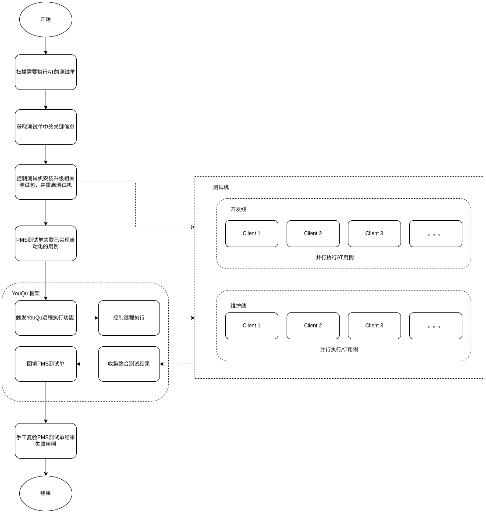

# 测试单驱动自动化测试

```shell
# ==================================
# Author : mikigo
# ==================================
```

## 一、测试流程



## 二、测试单关键信息规范

### 1、测试单名称

[日期]-[系统大版本]-[应用名称]-[应用版本]-[迭代阶段]-[第x轮]-【系统版本】xxx

举例：

[2023-12-12-专业版V20-软件包安装器-6.0.18.2-SP11-第1轮-【1062】BUG回归](https://pms.uniontech.com/testtask-view-35573.html)

### 2、测试单版本详情

在 **`版本详情`-`描述`** 中包含关键信息：

```shell
【镜像环境】：【1062】
【deb地址】：【http://10.0.32.52:5001/tasks/373109/】
【仓库源】：【deb [trusted=yes] https://aptly.uniontech.com/pkg/eagle-1063/release-candidate/44CQ5paH566h44CRMTA2M-mcgOaxgua1i-ivlS0yMDIzLTEyLTEyMjAyMy0xMi0xMiAxNDowNjowNw/ unstable main】
```

#### 多个deb地址或仓库源的情况

在同一个中括号里面写多个 deb 地址或仓库源地址，用 **`英文逗号`** 分隔；

```shell
【deb地址】：【deepin-deb-installer：http://10.0.32.52:5001/tasks/373109/,libqapt：http://10.0.32.52:5001/tasks/373108/】

【仓库源】：【deb [trusted=yes] https://aptly.uniontech.com/pkg/eagle-1063/release-candidate/44CQ5paH566h44CRMTA2M-mcgOaxgua1i-ivlS0yMDIzLTEyLTEyMjAyMy0xMi0xMiAxNDowNjowNw/ unstable main,deb [trusted=yes] https://aptly.uniontech.com/pkg/eagle-1063/release-candidate/44CQ5paH566h44CRMTA2M-mcgOaxgua1i-ivlS0yMDIzLTEyLTEyMjAyMy0xMi0xMiAxNDowNjowNw/ unstable main】
```

## 三、测试包获取&部署

### 1、deb地址

根据 deb 地址下载里面的所有 `deb` 包（排除了 `dbgsym` 和 `dev` 包）

### 2、仓库源

根据仓库源中的 `https` 地址，下载里面的 `deb` 包；（排除了 `dbgsym` 和 `dev` 包）

有同学在这里肯定要问了，

咦，等会儿，感觉小脑萎缩了，有仓库源为什么不用仓库源直接通过命令升级包，而要下载里面的包？

因为文管测试同学反馈，如果采用仓库源升级，有些包系统中没有但是仓库源中有，升级也不能把这些包安装上的，而且这些包是不确定的，因此咱们用下载的方式；

下载之后会在对应的测试机上去安装部署，部署完之后重启；

## 三、测试单自动关联用例

将所有 `是否已自动化` 为 `是` 且 `上线CD` 为 `是` 的用例自动关联到测试单中，用于执行自动化测试；

其中，如果在自动化工程中标记了 `skip-` 标签的用例不会被关联进来；

## 四、自动化测试并回填

目前有 4 个机型（ `FT2000`、`loongarch(3A5000)`、`L420`、`海光x86` ），分 2 条业务线（开发线和维护线）执行自动化测试；

基于 [**YouQu**](https://github.com/linuxdeepin/deepin-autotest-framework) 框架远程执行方案，控制远程测试机并行执行AT用例；

执行完之后 [**YouQu**](https://github.com/linuxdeepin/deepin-autotest-framework) 会回收所有机器的测试结果，并整合结果，如果某条AT用例在所有测试机上执行结果都是 `通过`，那这条用例的测试结果为 `通过`，否则为 `失败`；

最后将整合后的结果，回填到 `PMS` 测试单关联的用例中；

## 五、手工复验失败用例

对于测试单中某些用例执行状态是 `失败` 的，手工复测一下这些用例即可，如果手工复测没有问题，可直接将用例执行结果勾选为 `通过`；

>  这类情况一般是AT用例存在一些问题，在后续的AT开发过程中会进行修复，手工测试同学可以不用特别关注。

## 六、AT报告和AT过程日志

### AT报告

在 **[明道云-测试部-工具应用测试部-任务排期表-测试单任务视图](https://cooperation.uniontech.com/app/3642d1a4-7463-4bb6-96bc-69c5c1092a02/64083c8c571dca6a6b0c69e6/64097be258096ffd1a12dda2/64c35664cc11a7bd3d7e4b68)** 中，找到 **自动化报告** 列，点击里面的 `url` 即可访问测试单对应的自动化测试报告在线地址；

### AT过程日志

在 **[明道云-测试部-工具应用测试部-任务排期表-测试单任务视图](https://cooperation.uniontech.com/app/3642d1a4-7463-4bb6-96bc-69c5c1092a02/64083c8c571dca6a6b0c69e6/64097be258096ffd1a12dda2/64c35664cc11a7bd3d7e4b68)** 中，找到 **Jenkins URL** 列，点击里面的 `url` 即可访问测试单对应的 `Jenkins` 任务地址，可以查看整个测试过程的日志输出；
